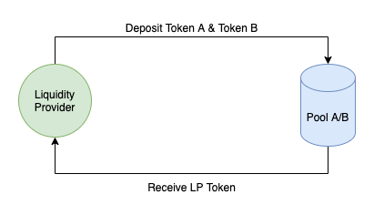

Pando Lake is an [Uniswap](https://uniswap.org) v2 implementation built with the MTG technology on Mixin Network. Benefit by Mixin's amazing TPS, Pando Lake has outstanding performance on tradings, most transactions can be confirmed in seconds.

## An Intro to Pando Lake

### Governance

Pando lake is maintained by five trusted nodes. Proposals such as create new pools must be approved by at least three nodes.

### Pool

Each Pool holds two tokens, which together represent a trading pair for those assets. 
Liquidity providers deposit tokens into pool to let traders trade；In return, the trade fees are all given to the liquidity provider according to the liquidity contribution ratio.

### LP Token

Each pool has a unique token (LP Token) to represent circulating liquidity. Holding LP Token is a proof of liquidity providing, and the withdrawal of liquidity also requires payment of LP Token.

The total market value of LP Token is equal to the sum of the market value of the two tokens in the Pool.

## Actions

### Deposit

Increase the reserves of a Pool to become liquidity provider.

### Withdraw

Pay LP Token back to the Pool to withdraw tokens inside. The reserves of the Pool will be decreased.

### Trade

Pools are always take the initiative to deal with traders automatically. Users can trade through the pools at any side, Pando Lake supports up to 4 pools for one transaction.

## Summary

Pando Lake has achieved the goal that decentralized the consensus among trusted nodes, bringing the dex service with multiple AMM formula to all users of the Mixin Network.

Pando Lake has performed well but is far from enough. We are working some new pools to make the liquidity more flexible and efficient. The management of trusted nodes needs to be more open to attract more participants too.

