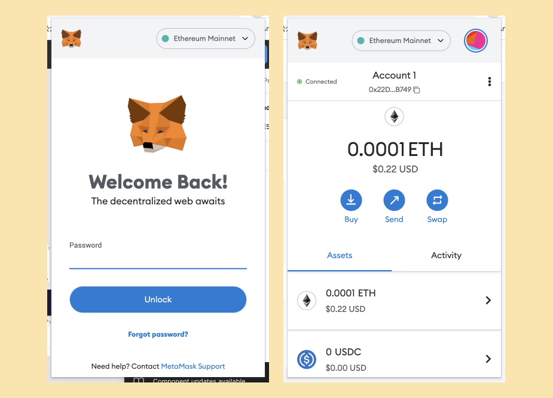
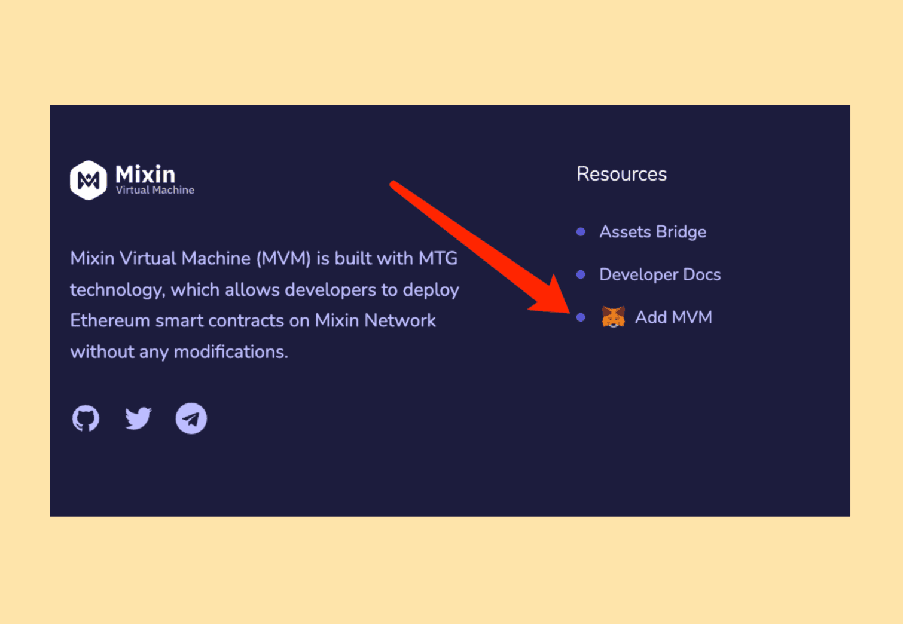
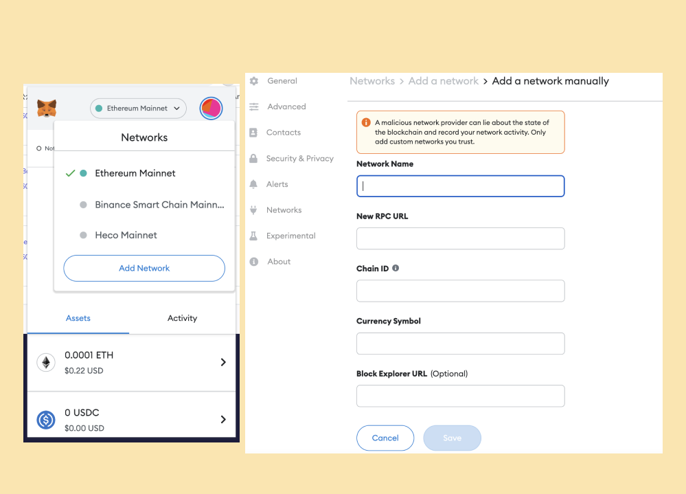
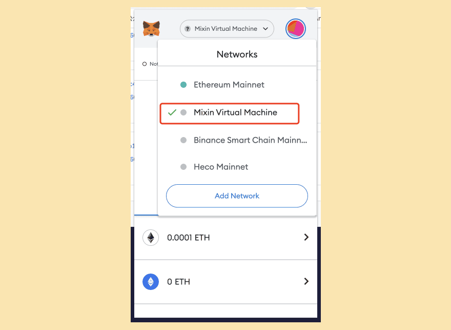
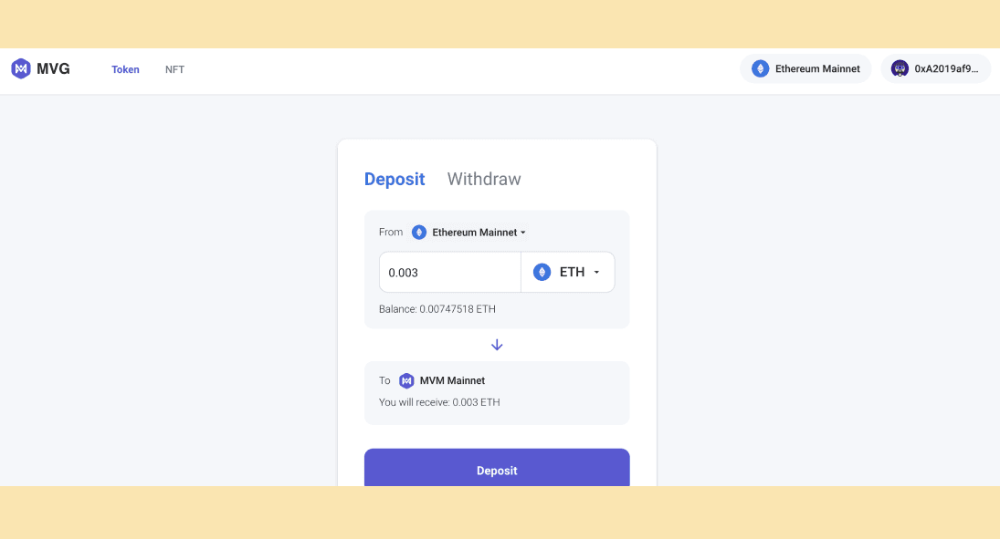
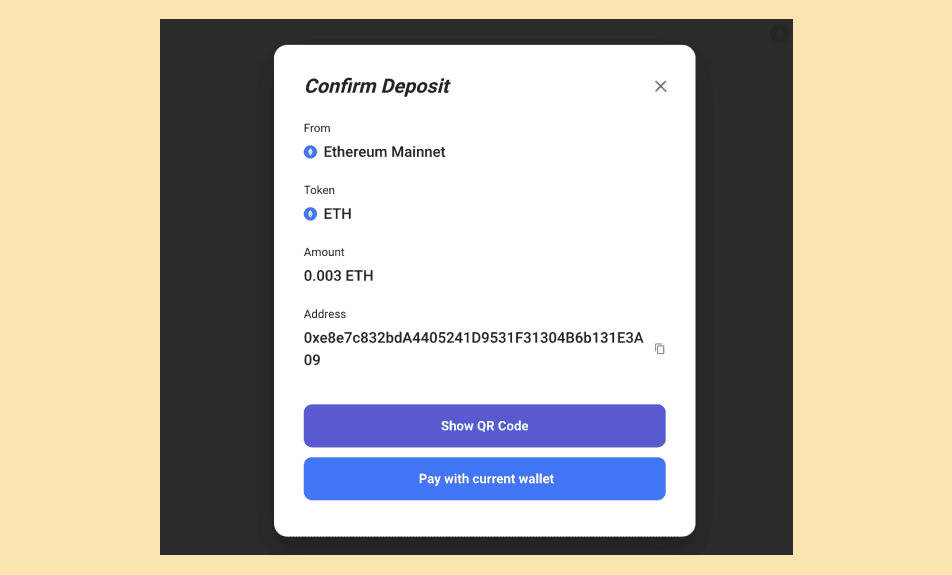
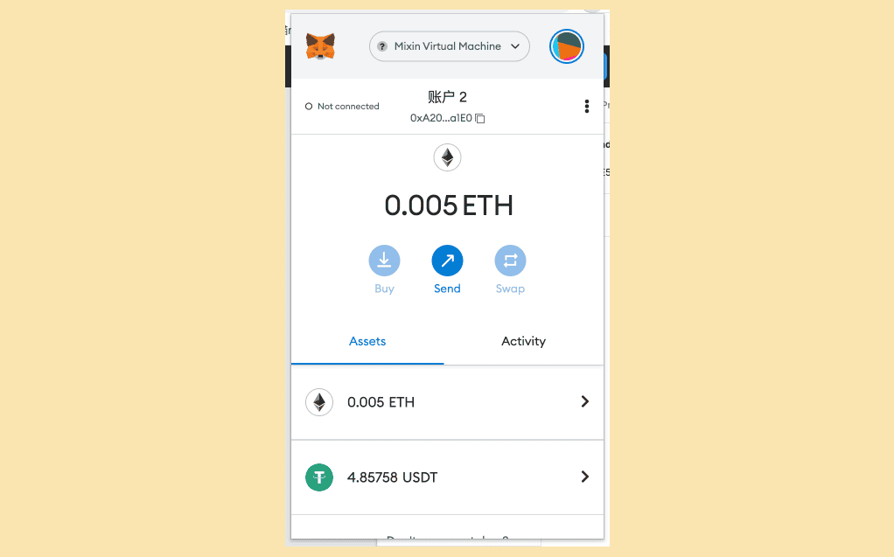
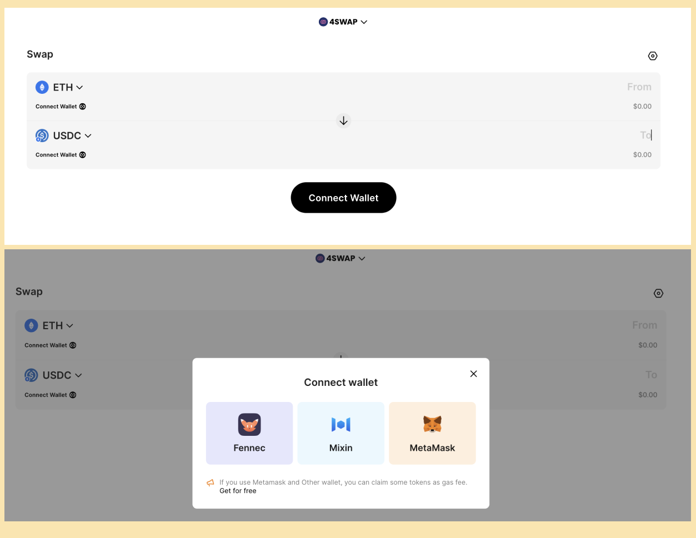
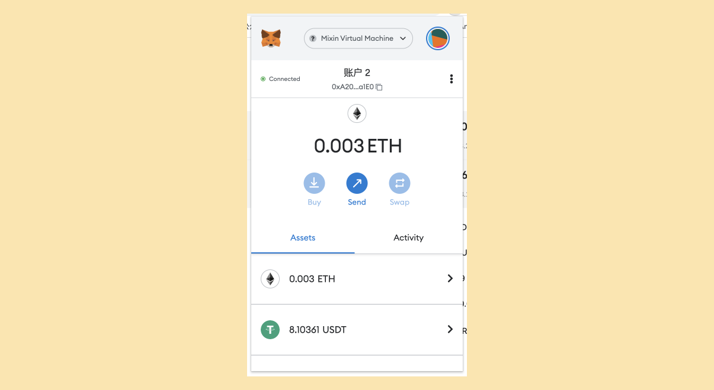

Now that you already have the Metamask wallet installed and are familiar with its basic functionalities.

Visit [MetaMask Support](https://metamask.zendesk.com/hc/en-us) to view instructions.

To ensure asset protection, follow the security instructions carefully and guard your private key and password.

## I. Integrating a MetaMask wallet with an MVM network

### Approach One

1. Go to MetaMask and keep your session active.

      

2. Locate using the [MVM Blockchain Viewer](https://scan.mvm.dev/). Place MVM at the base.

     

3. Confirm it when the confirmation window appears 

     

### Approach Two

1. Locate the network addition portal.

   

2. Complete the following information and validate the addition.

   

   Network name: Mixin Virtual Machine

   Network URL: https://geth.mvm.dev 

   Chain ID: 73927

   Currency symbol: ETH

   Block Browser: https://scan.mvm.dev/

After that, the MetaMask plug-in window's top allows you to view and switch networks.

- 

## II. Using other networks to send token/coin to the MVM network

It is crucial to make clear that in the following two steps, cross-link bridge is used, not address transfer, to send data to the MVM network via MetaMask.

1. Launch the [Assets Bridge](https://mvg.finance/) and link the MetaMask wallet. 

   

2. Decide to top up to the MVM network from another MetaMask network.

   

3. Select Top-up to acquire a wallet address to which you can send money directly using MetaMask by clicking on it

   

   

4. After the top-up, wait and verify the reception of the funds.(it is recommended to try small amounts for the first time)

   

## III. Using 4swap.org to connect MetaMask wallet for trading

The aforementioned two procedures have stored the digital assets on the MVM chain and have made it simple to trade them through 4swap as follows.

1. Use 4swap.org to connect to the MetaMask wallet.

   

   

2. Click “Swap” after choosing the currency and entering the quantity.

   

3. After the transaction, wait for a while before checking your balance.

   

## Join the Pando Community

Welcome to join our community and follow the latest community trends or event information.

- Twitter: [@4swapOrg](https://twitter.com/4swapOrg)

- Telegram: [t.me/its_4swapOrg](https://t.co/g7Vioijgjb)

- Discord: https://discord.com/invite/ek45g3Cymd

- Reddit: https://www.reddit.com/r/pando/

If you have already downloaded [Mixin Messenger](https://mixin.one/messenger), feel free to join our Mixin community.

4swap Community: 7000103925

Pando Community: 7000104110

If you have problems using Pando, you can check [Pando documentation](https://docs.pando.im/) or ask questions in the community. The administrator will be happy to help you.