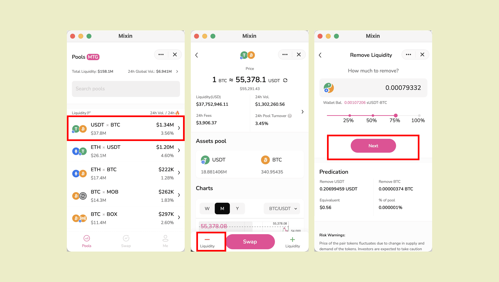

Entry 1: Pools page - click on the specific pool - Pool page "-"



Entry 2: If you are already on the Swap page, find "remove Liquidity" in the Assets pool section


Entry 3: If you have previously provided liquidity, you can find the pool on the Me page. Click on the pool and you will see "-"


````mdx-code-block
:::tip

There is no handling fee for remove liquidity.

:::
````