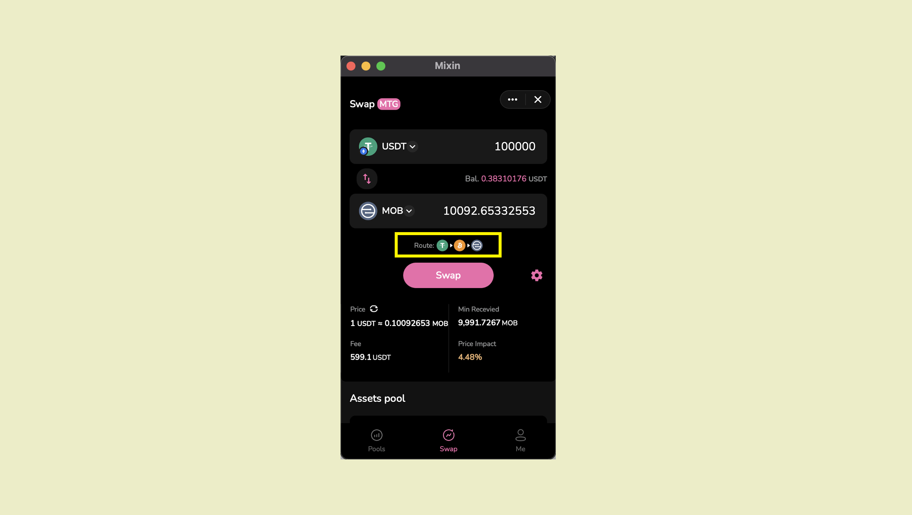

import {
  Improvement,
} from "@site/src/components/admonitions";

<Improvement />

By tapping the gear icon, you can set the [slippage](https://docs.pando.im/docs/lake/key-concepts/slippage-impernament-loss)

The route shows the steps your transaction will be processed. Algorithm calculates the optimal route so that you can receive the most asset possible.

After entering the 6-digit PIN to complete the payment, the transaction details will pop up. You can also view the transaction details in the dialog window.

