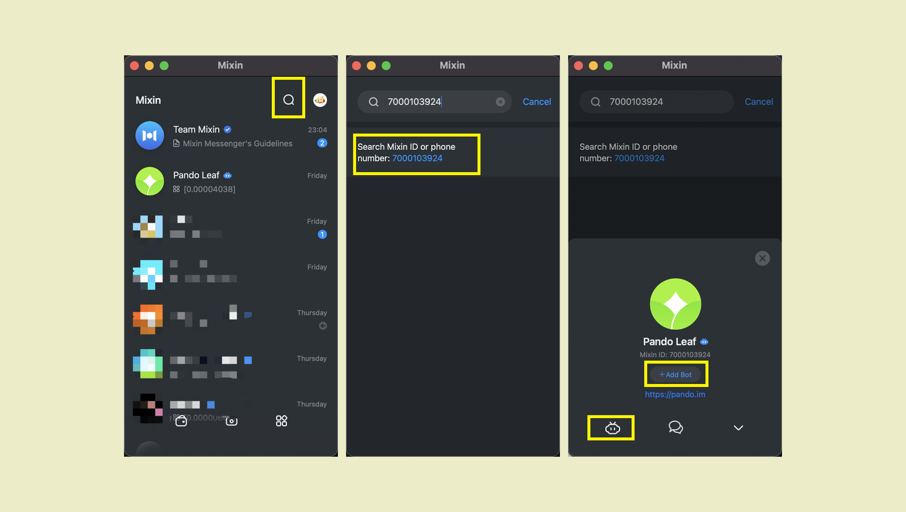
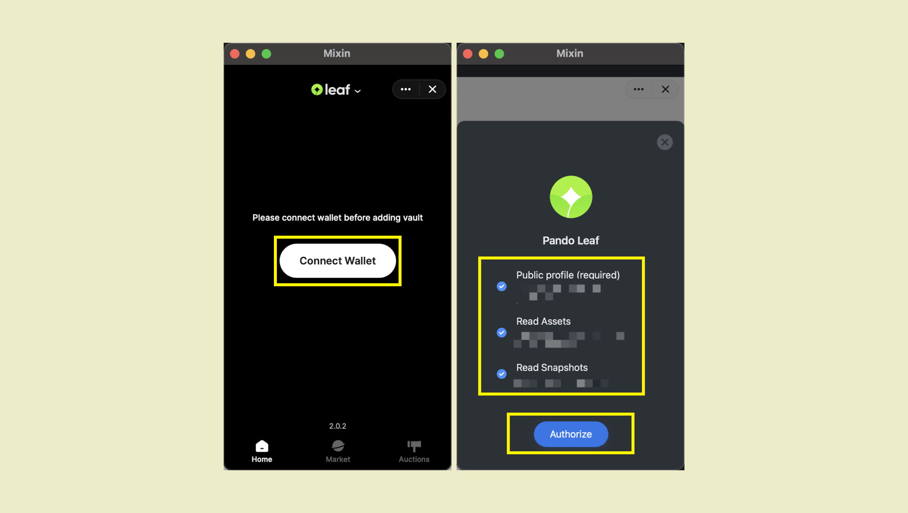

Pando leaf supports [mixin messenger](https://docs.pando.im/docs/wallets/mixin-messenger) wallet and [fennec](https://docs.pando.im/docs/apps/wallets) (web wallet) and the following content takes mixin messenger wallet as an example.

Visit [Pando Leaf](https://leaf.pando.im), or search Mixin ID **7000103924** on Mixin Messenger App and click blue number. Then add bot and click little robot avatar to open Pando leaf.




Click on "Connect Wallet" to start. Be sure to authorize otherwise data related to your assets won't be able to show on the interfaces 



````mdx-code-block
:::tip
Check all and authorize. Authorization can only view but cannot use your assets. It is safe.
:::
````

Let's get to know the homepage of pando leaf.


You are required to [add a vault](https://docs.pando.im/docs/leaf/tutorials/open-vault) when first enter.  Let's focus on the screenshot on the right.

BTC locked is your collateral in the vault. We can see 1 btc in the inmage means we pledged 1 btc in pando leaf.

What needs to be focused on is collateral Ratio, [Liquadation Price](https://docs.pando.im/docs/leaf/key-concepts/liquidation/liquidation-ratio), [current price and Next price](https://docs.pando.im/docs/leaf/key-concepts/price-oracles).

Take the above picture as an example, the current mortgage rate is 4414.4%, and the liquidation price is 1500 pusd, which means that when the price of BTC drops to 1500 pusd, it will be forced to enter the liquidation process.

Combined with the current price and the next price, it can be considered safe.

````mdx-code-block
:::caution
Please ensure that the collateral Ratio is within a safe range, which less than 150% will be liquidated totally.
:::
````

Go and try it.


