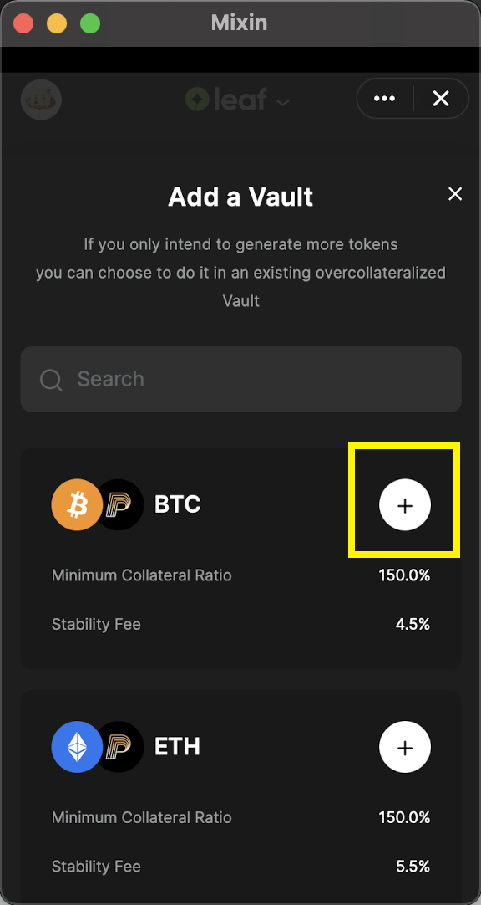

On “My page” of Pando Leaf, click on "Add a [Vault](https://docs.pando.im/docs/leaf/key-concepts/vaults)" to create a vault and then select from the list from the available vault types according to your needs. 


Click on "+" and you will land on the page to create a specific vault. 



On the corresponding minting page, respectively fill in the amount of the asset you intend to deposit and the amount of the asset you wish to generate

````mdx-code-block
:::tip
Generate a vault for the first time, minting at least 100 pusd
:::
````


Click on the button "Deposit to Generate" , make the payments,and allow for some time for the robot to process. 

If successfully created the [vault](https://docs.pando.im/docs/leaf/key-concepts/vaults), you will receive the notification and message in the chatbox. 


````mdx-code-block
:::caution
Do pay attention to the risk indication bar.
:::
````

You have to keep your collateralization ratio in a safe range（above 150%） to avoid [liquidation](https://docs.pando.im/docs/leaf/key-concepts/liquidation). When your collateralization ratio breaches the [liquidation ratio](https://docs.pando.im/docs/leaf/key-concepts/liquidation), your collaterals will be in [auction](https://docs.pando.im/docs/leaf/tutorials/auction-participation).  


