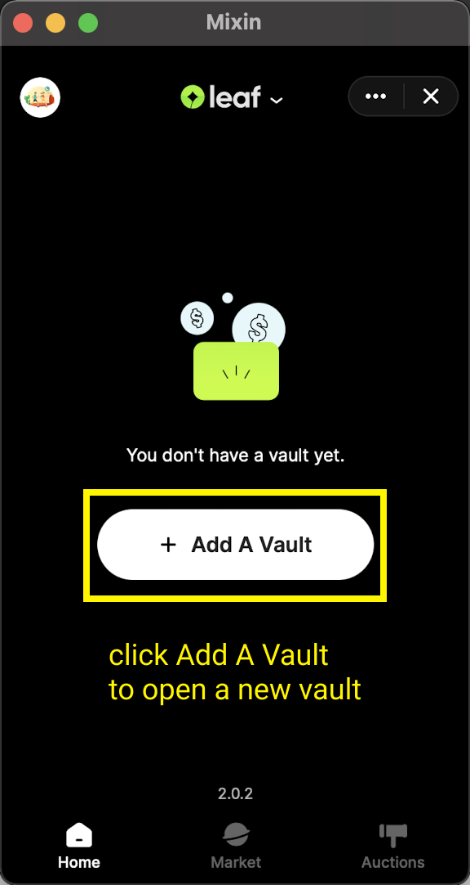
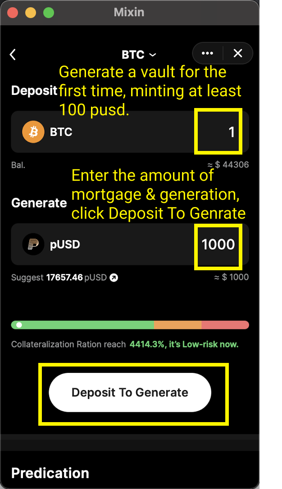

On “My page” of Pando Leaf, click on "Add a Vault" to create a vault and then select from the list from the available vault types according to your needs. 

Click on "+" and you will land on the page to create a specific vault. 

On the corresponding minting page, respectively fill in the amount of the asset you intend to deposit and the amount of the asset you wish to generate

Click on the button "Deposit to Generate" , make the payments,and allow for some time for the robot to process. 

If successfully created the vault, you will receive the notification and message in the chatbox. 

Do pay attention to the risk indication bar. You have to keep your **collateralization ratio**(link to the explanation required) in a safe range to avoid **liquidation** (link). When your collateralization ratio breaches the **liquidation ratio** (link), your collaterals will be in **auction** (link to auction process).  

