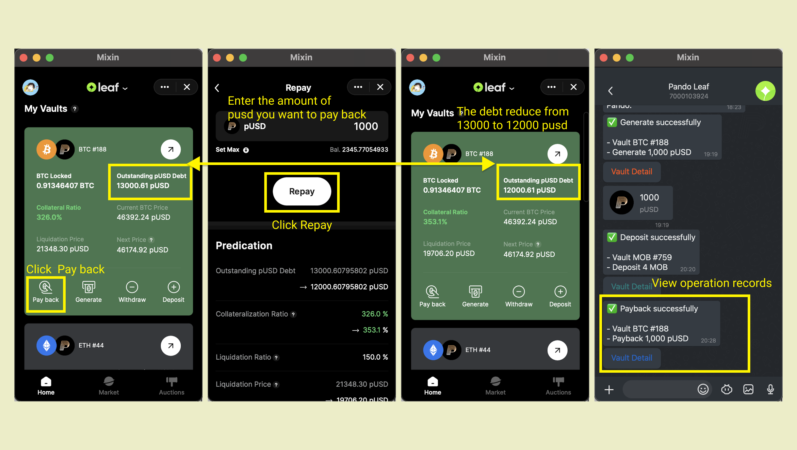
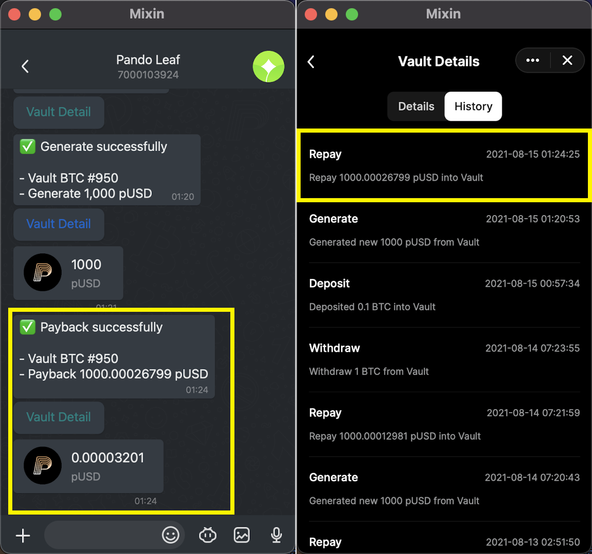

Paying back pUSD is useful when wanting to save a Vault from being liquidated, or the Vault owner wants to decrease the size of their position or to free up the collateral. 

To pay back, click on "Pay back" to land on the Pay Back page. Fill in the amount you intend to pay back manually or click "Set Max" to pay off all the debts. 

Please be noted that when you click "Set Max", you will be charged slightly higher than the outstanding debt amount to successfully pay off the debt because the interests are calculated and added to the debt real-time. Any excess amount after the payment will be returned to your wallet.  

