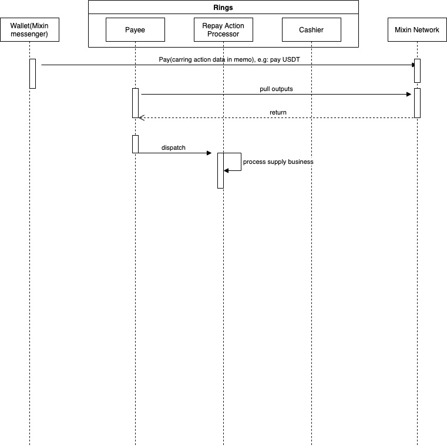
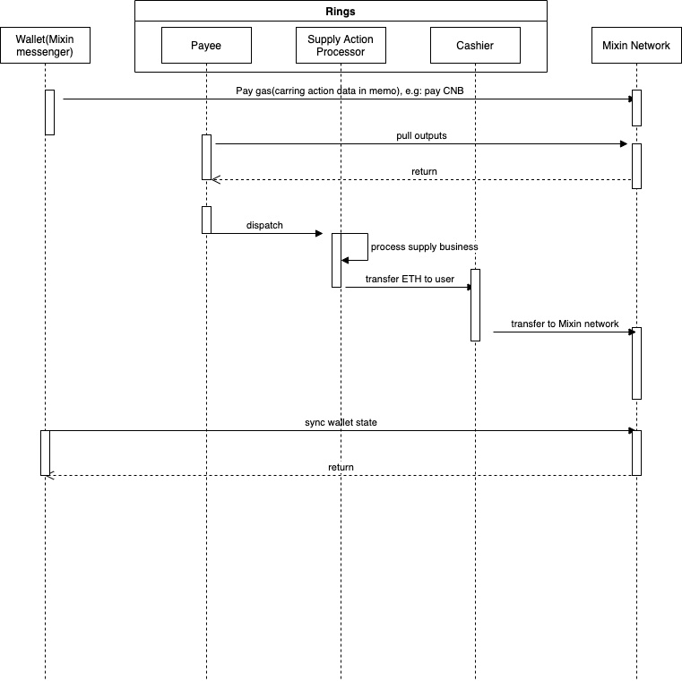
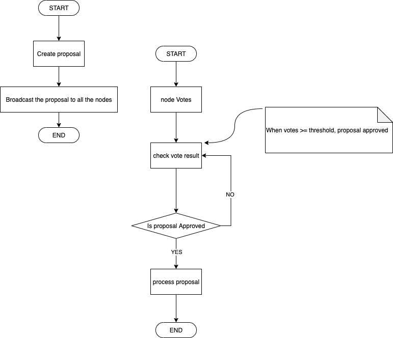

# Design

## Architecture

Ringe ist eine Implementierung von MTG und ein Fallschirm von Mixin Netzwerk.


#### MTG-Struct mischen


#### MTG System Datenfluss
* Der Nutzer überträgt eine Zahlung (UTXO), die Geschäftsdaten an das Mixin-Netzwerk überträgt.
* Ringe synchronisieren die Ausgabe(UTXO) durch Parsen der Geschäftsdaten (in output.memo)
* Ringe versenden die Geschäftsaktion (enthalten in Geschäftsdaten) und verarbeiten jede Handlung (Angebot, Kredit...)


Im MTG-System gibt es zwei Hauptrollen, eine ist `Zahler`, und die andere ist `Kassierer`, Die gesamte Geschäftslogik wird basierend auf diesen beiden Rollen implementiert.

* `Zahler` erhält die Ausgabe(Transaktionen) und decodiert die Geschäftsdaten von `Output.Memo`, versand `Aktionen` 

* `Kasse` das Token ausgeben, das Token wird an Benutzer übertragen 

#### Klingelaktionen

* `Versorgung`, Nehmen wir an, die Benutzer liefern das zugrundeliegende Token `ETH` und erhalten Sie das Equity-Token `rETH` 

* `Versprechen`, Nehmen wir an, die Benutzer versprechen das Equity-Token `rETH`,, dass Benutzer `Reth` an das Klingelsystem zahlen sollen 

* `Freigabe`, Nehmen wir an, dass Benutzer das Equity-Token nicht vergeben `rETH`,, dass Benutzer einige Token zahlen sollten und erhalten das Equity-Token `rETH` zurück 

* `Einlösen`, Nehmen wir an, dass Benutzer das zugrundeliegende Token einlösen `ETH` vom System bedeutet, dass die Benutzer das Equity-Token zahlen sollten `rETH` und wenn das quivalente zugrunde liegende Token erhalten `ETH` zurück 

* `Kredit`, Angenommen, Benutzer müssen das zugrunde liegende Token ausleihen `USDT`, bedeutet, dass Benutzer einige Token bezahlen sollten und den erwarteten Token erhalten `USDT` 

* `Rückzahlung`, Nehmen wir an, die Benutzer zahlen `USDT`, bedeutet, dass die Benutzer `USDT` bezahlen und die Schulden der Benutzer reduziert werden 

* `quick_pledge`, Nehmen wir an, die Benutzer liefern das zugrundeliegende Token `ETH` und kein Equity-Token `rETH` kehrt an die Benutzer zurück 
* `qick_redeem`, Nehmen wir an, dass Benutzer `ETH`einlösen Benutzer zahlen nur einige Token und erhalten das zugrunde liegende Token `ETH` zurück 
* `quick_borrow`, Angenommen, Benutzer können `ETH` oder `RETH` bereitstellen und können `USDT` Verzeichnis ausleihen 


* `Liquidation`, Annehmen Sie Benutzer A hat Pledged `ETH` und Geliehen `USDT`, sobald die Liquidität des Benutzerkontos weniger als oder gleich Null ist, kann es von anderen Benutzern liquidiert werden 

* `Vorschlagsaktionen`, alle Steuerungsarbeiten wirken sich durch die Abstimmung des Vorschlags aus, die aktuellen Vorschläge enthalten diese:
    1. `Markt` für Markterstellung oder Aktualisierung des Marktes
    2. `Offener Markt` für Marktöffnung
    3. `Märkte für geschlossene Märkte`
    4. `Zulassungsliste` ob die Liquidierung zulässig ist
    5. `Add-oracle-Unterzeichner` fügen Sie den Preisorakel-Unterzeichner hinzu, der Marktpreis anbietet
    6. `rm-oracle-signer` entferne den Preisorakel-Unterzeichner
    7. `zieht` die Reserven vom Markt zurück 

## Code-Struktur

```

---
|-cmd      
|-config  
|-deploy  
|-docs    
|-core 
|-pkg     
|-service 
|-store   
|-worker  
|-handler    
|-Dockerfile 
|-Makefile
|-main.go 

```

* [cmd](https://github.com/fox-one/compound/tree/master/cmd) command entry, including start api server and worker and governance tools
* [config](https://github.com/fox-one/compound/tree/master/config) default config directory
* [docs](https://github.com/fox-one/compound/tree/master/docs) project documents
* [core](https://github.com/fox-one/compound/tree/master/core) directory of project's models
* [pkg](https://github.com/fox-one/compound/tree/master/pkg) project packages that can be exported
* [service](https://github.com/fox-one/compound/tree/master/service) directory of business codes
* [store](https://github.com/fox-one/compound/tree/master/store) data repository(data may be stored in database or redis or memory cache)
* [Arbeiterverzeichnis](https://github.com/fox-one/compound/tree/master/worker) für Jobs, die Daten im Hintergrund verarbeiten
* [Handler](https://github.com/fox-one/compound/tree/master/handler) nur für exportierte Apis
* [Docs](https://github.com/fox-one/compound/tree/master/Dockerfile) project documents
* [Deploy](https://github.com/fox-one/compound/tree/master/deploy) store configs and tools of deployment
* [main.go](https://github.com/fox-one/compound/tree/master/main.go)
* [Makefile](https://github.com/fox-one/compound/tree/master/Makefile)

### [konfigurationsvorlage](https://github.com/fox-one/compound/tree/master/deploy/config.node.yaml.tpl)

```
# Fixed value : 1603382400 
genesis: 1603382400
# time localtion
location: Asia/Shanghai

# data base config
db:
  dialect: mysql
  host: ~
  read_host: ~
  port: 3306
  user: ~
  password: ~
  database: ~
  location: Asia%2FShanghai
  Debug: true

# mixin dapp config
dapp:
  num: 7000103159
  client_id: ~
  session_id: ~
  client_secret: ~
  pin_token: ~
  pin: ""
  private_key: ~

# nodes group config
group:
# private key shared by all nodes, that generated by the command: ./compound keys --cipher ed25519
  private_key: ~
  # The private key used by the current node for user data signing
  sign_key: ~
  # administratories of this node
  admins:
    - ~
    - ~
    - ~ 
  # Node member
  members:
    - client_id: ~
    # The public key used by the current node to verify the signature
      verify_key: ~
  threshold: 2
  vote:
    asset: 965e5c6e-434c-3fa9-b780-c50f43cd955c
    amount: 0.00000001
```

#### [Rest-APIs](https://github.com/fox-one/compound/tree/master/handler/rest/rest.go) für Anwendungsebene exportiert, einschließlich:

```
/markets/all //alle Märkte antworten
/transactions //Antworttransaktionen
/price-requests // für Preisorakel, die aufgerufen werden
```

#### Arbeiter
* [cashier](https://github.com/fox-one/compound/tree/master/worker/cashier/cashier.go) Processes the pending transfers. vorbereiten für die Übertragung einer Transaktion in das Mixin-Netzwerk.
* [Syncer](https://github.com/fox-one/compound/tree/master/worker/syncer/syncer.go) synchronisiert die Ausgabe(UTXO) aus dem Mixin Netzwerk.
* [txsender](https://github.com/fox-one/compound/tree/master/worker/txsender/sender.go) überträgt die Rohtransaktion in das Mixin Netzwerk.
* [ausgegebener Sync](https://github.com/fox-one/compound/tree/master/worker/spentsync/spentsync.go) synchronisiert und aktualisiert den Übertragungsstatus.
* [Priceoracle](https://github.com/fox-one/compound/tree/master/worker/priceoracle/priceoracle.go) holt einen Preis und legt den Preis auf die Kette.
* [Zahlungsempfänger](https://github.com/fox-one/compound/tree/master/worker/snapshot/payee.go) verarbeitet Ausgänge und versendet Geschäftsmaßnahmen.

#### Aktionsbearbeitung
* [borge](https://github.com/fox-one/compound/tree/master/worker/snapshot/borrow.go) kümmert sich um das Darlehens-Aktionsereignis.
* [Lieferung](https://github.com/fox-one/compound/tree/master/worker/snapshot/supply.go) behandelt das Ereignis der Lieferung.
* [Versprechen](https://github.com/fox-one/compound/tree/master/worker/snapshot/supply_pledge.go) behandelt das Ereignis der Versprechung.
* [Unpledge](https://github.com/fox-one/compound/tree/master/worker/snapshot/supply_unpledge.go) behandelt das Unpledge Action-Ereignis.
* [einlösen](https://github.com/fox-one/compound/tree/master/worker/snapshot/supply_redeem.go)behandelt das Aktionsereignis einlösen.
* [zurückzahlen](https://github.com/fox-one/compound/tree/master/worker/snapshot/borrow_repay.go)behandelt das Aktionsereignis "Rückzahlung".
* [Liquidation ](https://github.com/fox-one/compound/tree/master/worker/snapshot/liquidation.go)behandelt das Liquidations aktion sereignis
* [vorschlage](https://github.com/fox-one/compound/tree/master/worker/snapshot/proposal.go)bearbeitet und versendet die Vorschlagsmaßnahmen, einschließlich: Hinzufügen eines Marktes, Aktualisieren des Marktes, Schließen oder öffnen des Marktes, Hinzufügen oder Entfernen der Zulassungsliste, zurückziehen
* [price](https://github.com/fox-one/compound/tree/master/worker/snapshot/price.go)behandelt das protokale Aktionsereignis price.


### Marktbeschränkungsmechanismus

> Schließen Sie den Markt, wenn der Preis für einen bestimmten Markt abnormal ist.

* Wenn der Preis eines Marktes bösartig angegriffen wird, Manager haben das Recht, den `Close-Market` Auftrag auszuführen und eine geschlossene Marktzahl zu beantragen. Wenn der Antrag angenommen wird, wird der Markt geschlossen.
* Der Handel ist in geschlossenen Märkten verboten.
* Solange es jedoch geschlossene Märkte gibt, wird die Liquidation aller Märkte verboten, weil die Liquidation die Liquidität aller Marktkonten der Nutzer beeinflussen wird.

## Die Umsetzung des Compound-Protokolls

* [Zinsmodell](https://github.com/fox-one/compound/tree/master/internal/compound/interest_rate_model.go) ist die Kernimplementierung des Compound Protokolls.

* [Kreditsaldo](https://github.com/fox-one/compound/tree/master/core/borrow.go) des Benutzers Kreditsaldo enthält Kreditgrundsätze und Darlehenszinsen. `balance = borrow.principal * market.borrow_index / borrow.interest_index`

* [Anfallzinsen](https://github.com/fox-one/compound/tree/master/service/market/market.go) Angesammelte Zinsen treten nur dann auf, wenn es ein Verhalten gibt, das Änderungen in den Markttransaktionsdaten verursacht B. Angebot, Kredite, Verpfändung, Verpfändung, Verpfändung, Einlösung, Rückzahlung, Preisaktualisierung. Und nur einmal im gleichen Block berechnet.

```
    blockNumberVor := market.BlockNummer

    blockNum, e := s.blockSrv. etBlock(ctx, time)
    wenn e ! nil {
        return e
    }

    blockDelta := blockNum - blockNumberPrior
    if blockDelta > 0 {
        borrowRate, e := s. urBorrowRatePerBlockInternal(ctx, market)
        wenn e ! nil {
            return e
        }

        wenn Markt. orrowIndex.LessThanOrEqual(decimal.Zero) {
            Markt. orrowIndex = borrowRate
        }

        timesBorrowRate := borrowRate. ul(decimal.NewFromInt(blockDelta))
        interessanterweise := Markt. otalBorrows.Mul(timesBorrowRate)
        totalBorrowsNeu := interestAccumulated.Add(market.TotalBorrows)
        totalReservesNew := interessanterhebt. ul(market.ReserveFactor).Add(market.Reserves)
        borrowIndexNeu := market.BorrowIndex.Add(timesBorrowRate. ul(market.BorrowIndex))

        market.BlockNumber = blockNum
        market.TotalBorrows = totalBorrowsNew. runcate(16)
        market.Reserves = totalReservesNew. runcate(16)
        market.BorrowIndex = borrowIndexNew.Truncate(16)
}

```