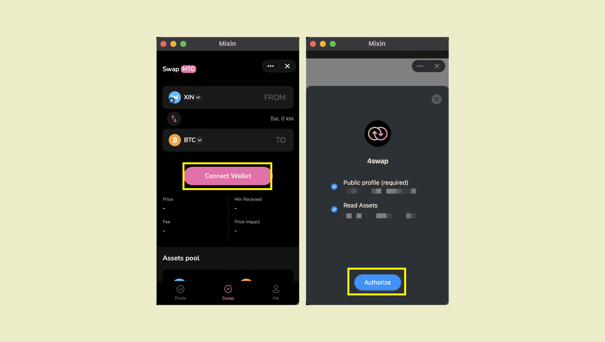
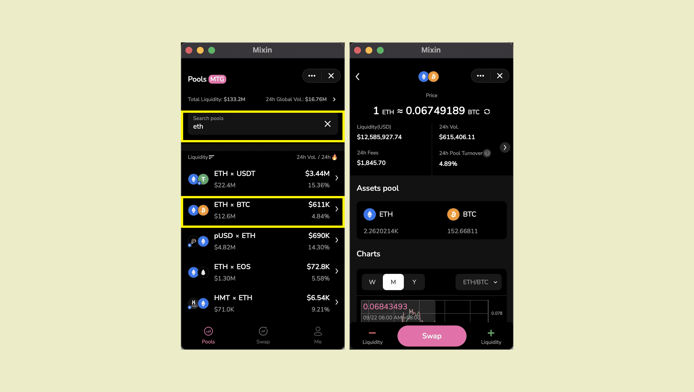

Pando lake(4swap) supports [mixin messenger](https://docs.pando.im/docs/wallets/mixin-messenger) wallet and [fennec](https://docs.pando.im/docs/apps/wallets) (web wallet) and the following content takes mixin messenger wallet as an example.

Visit [Pando lake(4swap)](https://lake.pando.im), or search Mixin ID **7000103537** on Mixin Messenger App and click blue number. Then add bot and click little robot avatar to open Pando lake(4swap).


Click on "Connect Wallet" to start. Be sure to authorize otherwise data related to your assets won't be able to show on the interfaces.



````mdx-code-block
:::tip

Check all and authorize. Authorization can only view but cannot use your assets. It is safe.

:::
````

Let's get to know the homepage of pando lake(4swap).


Enter the "pool" page, we can see various trading pairs. We can click the right arrow ➡️ at the top right to view the data analysis.

You can also click to sort different transaction pairs based on data such as total supply and 24-hour transaction volume.



The search function can quickly locate the trading pairs related to the currency we want to trade. For example, in above picture, searching for eth can quickly display all trading pairs related to eth.

Enter the eth/btc trading pair, you can view more detailed information, and you can quickly jump to the "[swap](https://docs.pando.im/docs/lake/tutorials/swapping)" and "[liquidity pages](https://docs.pando.im/docs/lake/tutorials/providing-liquidity)".


