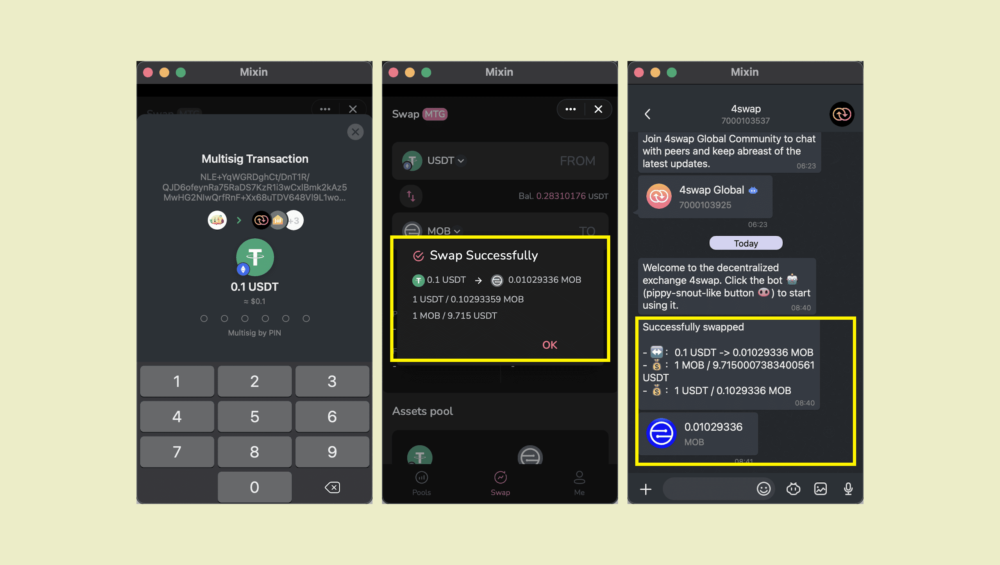

By tapping the gear icon, you can set the [slippage](https://docs.pando.im/docs/lake/key-concepts/slippage-impernament-loss)


The route shows the steps your transaction will be processed.


Algorithm calculates the optimal route so that you can receive the most asset possible.


 After entering the 6-digit PIN to complete the payment, the transaction details will pop up. You can also view the transaction details in the dialog window.


Click to view [transaction fees](https://docs.pando.im/docs/lake/key-concepts/trading-fee).

````mdx-code-block
:::caution

Bitte achte beim Swappen auf den Preiseffekt. 

When the price impact is too high, it means that the transaction is lack of liquidity or the transaction amount is too large, and continuing trading may cause greater losses.

:::
````