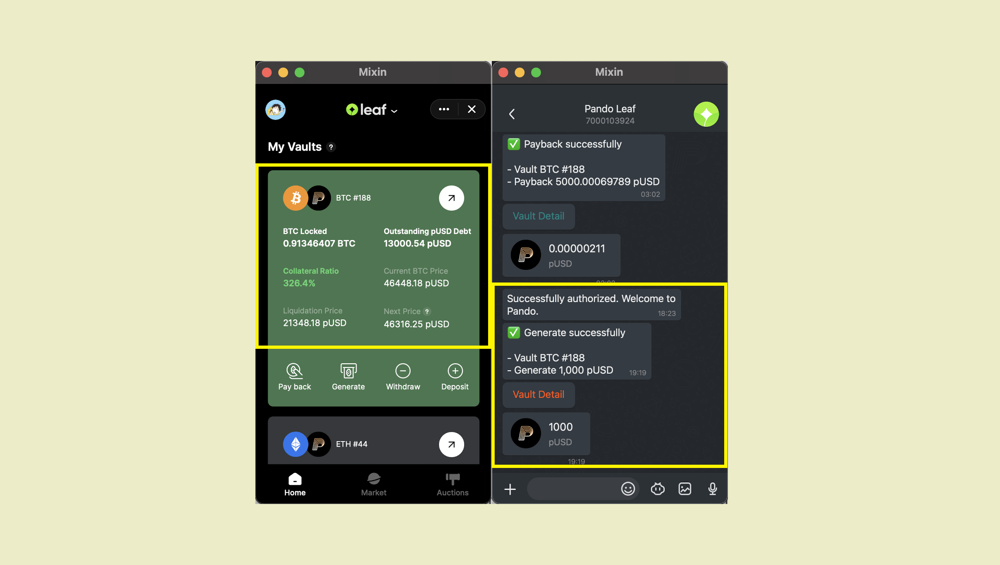

Um PUSD zu generieren, klicken Sie auf "Generieren" und geben Sie den Betrag ein, den Sie auf der Seite Generieren generieren möchten.


Daten ändern sich auf die neusten und Sie können Details über diese Generierung im Chatfenster sehen.




Auch hier müssen Sie auf das damit verbundene Risiko achten.

````mdx-code-block
:::caution

Bitte stellen Sie sicher, dass sich der Hypothekarzinssatz in einem sicheren Bereich befindet, der weniger als 150% beträgt [liquidated] ist.

:::
````

````mdx-code-block
:::info

Du brauchst [pando seed](https://docs.pando.im/docs/leaf/key-concepts/pando-seed) um diese Operation zu unterstützen.

:::
````
