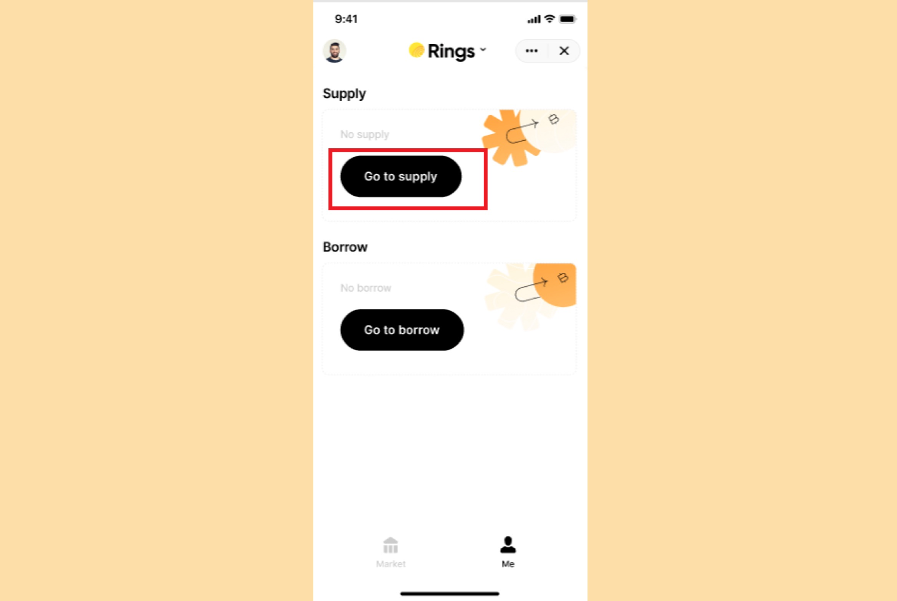

Supplying is the first step in Pando Rings. When users supply an asset to Pando Rings, they begin earning interest instantly. Interest accrues every minute; users can withdraw their principal plus interest anytime.

To supply an asset, you can click on "I want to supply" on the Market Page. It will bring you to the list of Supply assets you can choose from. You will see [Supply Volume](../key-concepts/glossary)and [Supply APY](../key-concepts/glossary) of the asset.

After clicking on the asset, you will land on the Supply page.

You can also find the entry to supply if you already entered the Market Overview page and have chosen to view statistics of a specific market. You will find the Supply entry on the asset statistics page.

If you haven't supplied any asset, you can also find the entry to supply on the Me page. Clicking on "Go to supply" and you will land on the Supply page.

On the Supply page, you will see key metrics related to the Supply process including the asset's Supply APY, amount you have supplied of the specific asset ("**Supplying**"), the total amount of all the assets you have supplied (**Total Supply**), the total amount you haven't pledged as collateral (**Total Unpledged**) and the exchange rate between the rToken and its underlying asset.

Enter the amount of the asset you want to supply, and you will see a bottom sheet asking whether you want to pledge the supply volume. The percentage on the right arrow represents [Collateral Factor](../key-concepts/glossary).

As you need to pledge before borrowing on Pando Rings, if you choose "**Supply and Pledge**", you will immediately get the borrow capacity; or if you only want to earn some interest by supplying the asset, you can choose "Supply Only".

