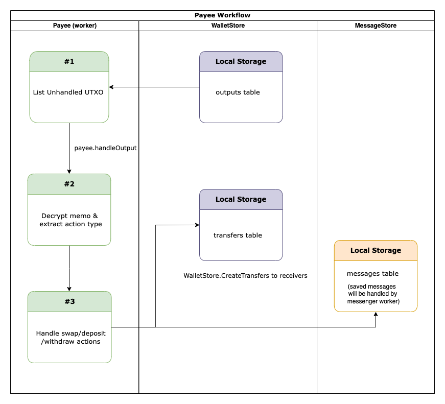

## 4swap Design Document

> Pando Lakeは、Uniswap V2のMixin Network上でのMTG実装です。

Pando Lakeは、一定の製品フォーミュラを利用した自動流動性プロトコルであり、 [Mixin Trusted Group](https://developers.mixin.one/docs/mainnet/mtg/overview)に実装されています。 分散型、検閲への抵抗、セキュリティを優先して、単一のMixinDappの必要性を排除します。

プールトークンと引き換えに、基礎となる各トークンの同等の価値を預けることにより、誰でもプールの流動性プロバイダー（LP）になることができます。 これらのトークンは、総準備金の比例LPシェアを追跡し、いつでも原資産と引き換えることができます。

ペアは自動化されたマーケットメーカーとして機能し、「一定の製品」の公式が維持されている限り、一方のトークンをもう一方のトークンとして受け入れる準備ができています。 この式は、最も簡単に** x * y = k </ strong>として表され、取引はペアの準備金残高（xとy）の積（k）を変更してはならないことを示しています。  Kは取引の参照フレームから変更されないままであるため、不変量と呼ばれることがよくあります。 この公式には、(準備金と比較して) 大規模な取引が小規模な取引よりも指数関数的に悪いレートで実行されるという望ましい特性があります。

> USDT / USDCなどのステーブルコインプールで使用される修正された<ahref = "https://curve.fi">曲線</a>式。

## Interact with 4swap

All participants of 4swap complete the interaction by transferring tokens to the multisig wallet. Node worker **Syncer** syncs the payments as mixin multisig outputs; another worker **Payee** processes all outputs in order.

### Mixin Multisig Output

**Output:**

| field     | description      |
| --------- | ---------------- |
| CreatedAt | payment time     |
| AssetID   | payment asset id |
| Amount    | payment amount   |
| Memo      | extra message    |

**Output Memo:**

**Memo** contain the **TransactionAction** information.

The memo is AES-encrypted, an ed25519 public key used for compound AES key/iv will be in the first 32 bytes.

### TransactionAction Definition

| field      | description                                | type   |
| ---------- | ------------------------------------------ | ------ |
| Action     | swap, deposit or withdraw                  | number |
| UserID     | mixin id used for receipt                  | uuid   |
| FollowID   | user defined trace id for this transaction | uuid   |
| Parameters | relevant parameters                        | bytes  |

## Workers

1. **Syncer** sync unhanded utxo by mixin messenger api & store into WalletStore as **outputs** in created asc order.
2. **Payee** pull unhanded utxo from WalletStore in order and parse memo to get the action then handle it. Transfers may be created during handling.
3. **Assigner** select enough unspent UTXO and assign to a pending transfer.
4. **Cashier** pull unhandled transfers from WalletStore in order, then request & sign multisig transfer. If enough signatures collected, generate a raw transaction.
5. **TxSender** commit raw transactions to Mixin Network.

### Syncer Workflow

### Payee Workflow

### Assigner & Cashier & TxSender Workflow

## Actions

### Deposit

Each Pando Lake liquidity pool is a trading venue for a pair of Mixin Mainnet tokens. When a pool is created by the governance, its balances of each token are 0; in order for the pool to begin facilitating trades, someone must seed it with an initial deposit of each token. This first liquidity provider is the one who sets the initial price of the pool.

The number of liquidity tokens This first liquidity provider will receive would equal `sqrt(x*y)`, where x and y represent the amount of each token provided. For the following providers, the number will be `min(x/reserve_x,y/reserve_y)*liquidity_shares`.

**Parameters:**

| name     | type    | description                |
| -------- | ------- | -------------------------- |
| AssetID  | uuid    | opposite asset id          |
| Slippage | decimal | max slippage allowed       |
| Expire   | int64   | deposit timeout in seconds |

### Swap

From the constant product formula it follows that the price of that token A is simply price_token_A = reserve_token_B / reserve_token_A. The market price only moves as the reserve ratio of the tokens in the pool changes, which happens when someone trades against it.

The swapping rule is the constant product formula. When either token is withdrawn, a proportional amount of the other must be deposited, in order to make the constant(`k`) unchange.

Pando Lake applies a 0.3% fee (0.04% for stablecoin pools) to trades, which is added to reserves to increases `k` actually as a payout to liquidation providers.

**Parameters:**

| name    | type    | description                                 |
| ------- | ------- | ------------------------------------------- |
| AssetID | uuid    | target asset id                             |
| Route   | string  | swap routes                                 |
| minimum | decimal | minimum amount acceptable, refund otherwise |

### Withdraw

To retrieve the underlying liquidity, plus any fees accrued, liquidity providers must give back their liquidity tokens, effectively exchanging them for their portion of the liquidity pool, plus the proportional fee allocation.

The number of tokens retrieved will be `lp_token/liquidity_shares*reserve_x` and `lp_token/liquidity_shares*reserve_y`.
