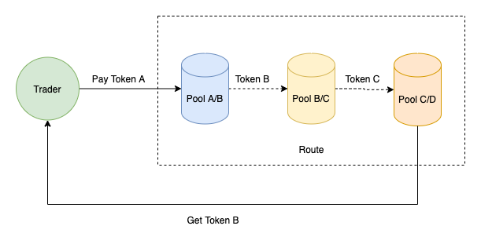

Pando Lakeは、MixinNetwork上のMTGテクノロジーで構築された<ahref = "https://uniswap.org"> Uniswap </a> v2実装です。  Mixinの驚くべきTPSの恩恵を受けて、Pando Lakeは取引で卓越したパフォーマンスを発揮し、ほとんどの取引は数秒で確認できます。

## Pando Lakeの紹介

### 管理機構

Pando lakeは5つの信頼できるノードによって維持されています。  新しいプールの作成などの提案は、少なくとも3つのノードによって承認される必要があります。

### 保持

各プールには2つのトークンがあり、これらは一緒になってそれらの資産の取引ペアを表します。 流動性プロバイダーは、トレーダーが取引できるようにトークンをプールに預けます；その見返りとして、取引手数料はすべて、流動性貢献率に従って流動性プロバイダーに与えられます。

### LPトークン

各プールには、循環流動性を表す固有のトークン(LPトークン) があります。 LPトークンの保有は流動性提供の証拠であり、流動性の引き出しにはLPトークンの支払いも必要です。

LPトークンの合計市場価値は、プール内の2つのトークンの市場価値の合計に等しくなります。

## 動作

### 保証金

プールの準備金を増やして流動性プロバイダーになります。

### 引き出し

LPトークンをプールに返済して、内部のトークンを引き出します。 プールの予備は減少します。

### 取引

プールは常にトレーダーに自動的に対処するための主導権を握っています。 ユーザーはどちらの側でもプールを介して取引できます。PandoLakeは1回のトランザクションで最大4つのプールをサポートします。

## 概要

Pando Lakeは、信頼できるノード間でコンセンサスを分散させるという目標を達成し、Mixinネットワークのすべてのユーザーに複数のAMM式を備えたdexサービスを提供します。

Pando Lakeは順調に推移していますが、まだまだ十分とは言えません。 流動性をより柔軟かつ効率的にするために、いくつかの新しいプールに取り組んでいます。 信頼できるノードの管理は、より多くの参加者を引き付けるために、よりオープンである必要があります。

