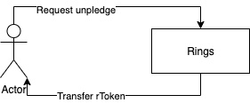

<ahref = "https://github.com/MixinNetwork/mixinに基づく<ahref =" https://github.com/compound-finance/compound-protocol ">複合プロトコル</a>の実装 "> Mixin </a> [ MTG ](https://github.com/MixinNetwork/developers.mixin.one/blob/main/developers/src/i18n/en/document/mainnet/mtg.md)テクノロジー。

## rトークン

いくつかの暗号化された通貨を市場に提供した後に取得する対応する証明書トークン。

## 機能

### 供給

ユーザーは暗号化された通貨を市場に供給して流動性を提供し、 対応するrTokenを取得します。 彼らは流動性を提供することによって利回りを受け取ります。

### 誓約

ユーザーは借りる前にrTokenを市場に誓約する必要があります。

### 誓約を解除する

ユーザーは、市場に約束したrTokenを取り戻します。

### 償還

ユーザーは、流動性を提供するための報酬としての利回りを含め、以前に提供された対応する暗号化された通貨と引き換えにrTokenを返します。

### 借りる

ユーザーは、暗号化された通貨を特定の金利で市場から借ります。

### 返済

ユーザーは、借用した暗号化された通貨と、借用期間中に発生した利息を返済します。

### 清算

市場価格の変動により、利用者のローンの価値が担保資産の価値を超える場合があります。  その場合、他のユーザーはより低い価格を使用してユーザーの担保資産を取得し、担保資産でカバーされていないユーザーの債務を返済することができます。

