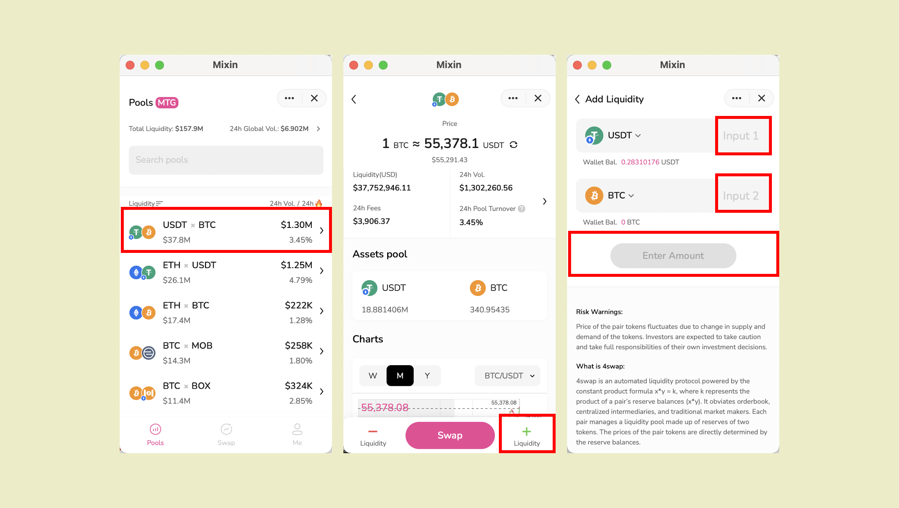

流動性を追加する方法は3つあります。

エントリ1：プールページ-特定のプールをクリックします-プールページ「+」



エントリ2：すでに[スワップ]ページを表示している場合は、[資産プール]セクションで[流動性の追加]を見つけます。


エントリー3：以前に流動性を提供したことがある場合は、Meページでプールを見つけることができます。  プールをクリックすると「+」が表示されます


流動性を追加すると、ダイアログウィンドウに対応するlpトークンが表示されます。


````mdx-code-block
:::ヒント

1. 流動性を正常に提供し、LPトークンを取得するには、2種類の暗号通貨を同時に追加する必要があります。 1つだけ追加してページを終了する場合、または追加後にLPトークンを取得しない場合でも、心配しないでください。支払った通貨は10分以内に返金されます。

2. 流動性を追加するための手数料はありません。

:::
````