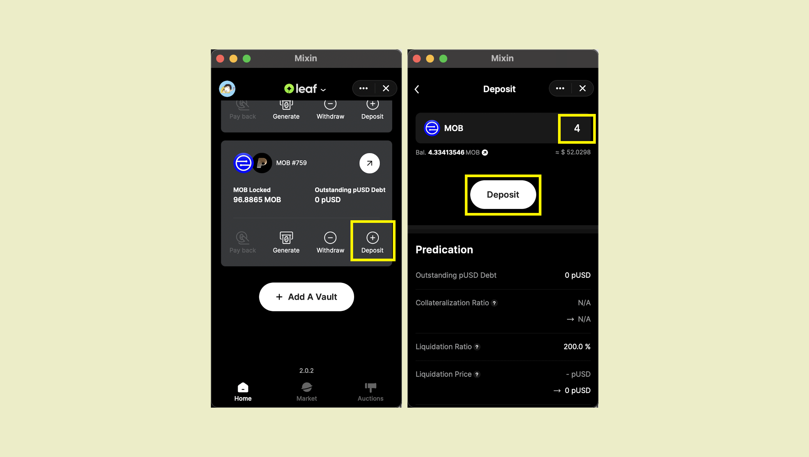

担保の追加は、2つのシナリオで役立ちます。 1つ目は、Vaultが<strongx-id = "1">清算</ strong>（清算へのリンク）に近づいているときです。担保を追加すると、Vaultを節約できます。  2つ目は、Vaultの所有者がpUSDを生成するための容量を増やしたい場合です。担保を追加すると、生成できるpUSDの最大量が増えます。

担保を追加するには、「デポジット」をクリックして、デポジットページに目的の金額を入力します。 次に、追加する担保の数量を入力して、右側の画像の[デポジット] をクリックします。

4 MOBトークンを支払い、詳細を参照してください。 担保の増加96.8865から100.8865。  あなたはこのチャットウィンドウへの追加について詳細を見ることができます

