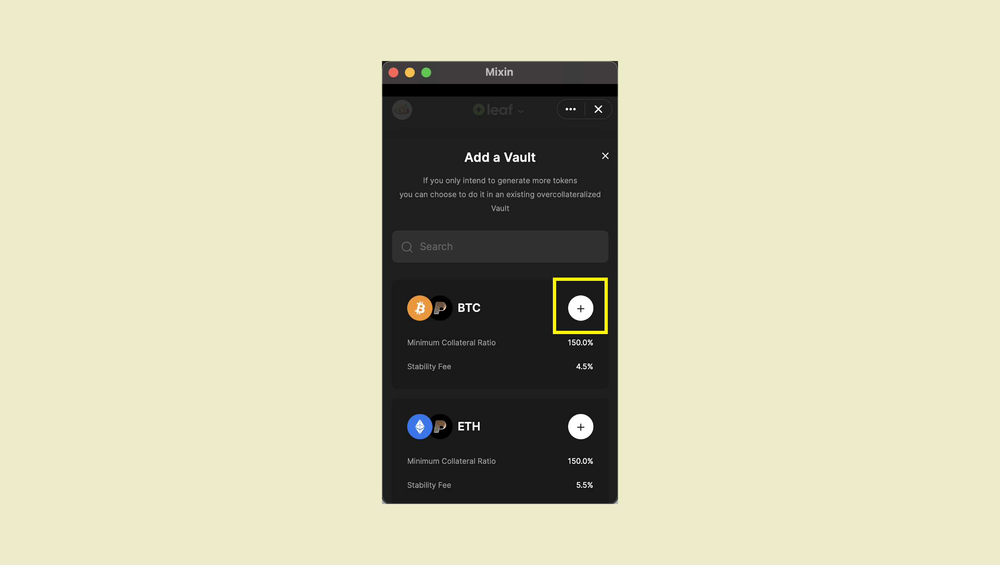

On “My page” of Pando Leaf, click on "Add a [Vault](https://docs.pando.im/docs/leaf/key-concepts/vaults)" to create a vault and then select from the list from the available vault types according to your needs.


「+」をクリックすると、特定の保管庫を作成するためのページが表示されます。



対応する分割ページで、預金する予定の資産の金額と生成する資産の金額をそれぞれ入力します

````mdx-code-block
:::tip
Generate a vault for the first time, minting at least 100 pusd
:::
````


「Depositを生成する」ボタンをクリックして支払いを行い、ロボットが処理するまでしばらく待ちます。

If successfully created the [vault](https://docs.pando.im/docs/leaf/key-concepts/vaults), you will receive the notification and message in the chatbox.


````mdx-code-block
:::注意
リスク表示バーに注意してください。
:::
````

You have to keep your collateralization ratio in a safe range（above 150%） to avoid [liquidation](https://docs.pando.im/docs/leaf/key-concepts/liquidation). When your collateralization ratio breaches the [liquidation ratio](https://docs.pando.im/docs/leaf/key-concepts/liquidation), your collaterals will be in [auction](https://docs.pando.im/docs/leaf/tutorials/auction-participation).


