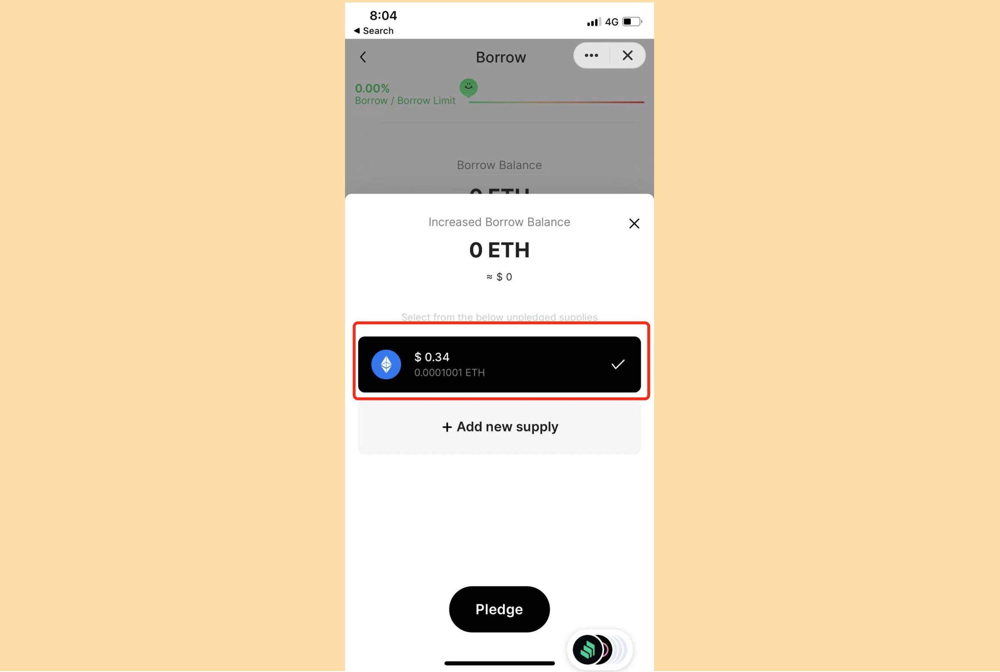

Pando Ringで資産を借りたい場合は、マーケットページの「借りたい」をクリックしてアクセスできます。 借りたい資産を選択すると、「借りる」ページが表示されます。


すでに[市場の概要]ページに入り、特定の市場の統計を表示することを選択した場合は、資産統計ページから借りることもできます。


まだ借りていない場合は、Meページで借りることもできます。 ただし、すでに未払いの借入金がある場合は、ここで借入資産のカードのみを表示できます。


After landing on the Borrow page, if you have enough [borrow balance](../key-concepts/glossary), you can finish borrow within no time.


または、十分な借入残高がない場合は、「残高を増やす」をクリックしてさらに取得できます。 You can then conveniently get borrow capacity by choosing from the assets that you have supplied but not pledged (remember any borrow from Pando Rings has to be collateral-backed) or if you need more borrow capacity than the unpledged assets can produce, you can click on "Add new supply" to supply and pledge **all** of your new supply.




借用残高が増えたので、借用ページから好きなように借用できます。 :)

The [loan risk indicator](../key-concepts/loan-risk-indicator) changes with the amount you enter and predicts whether your borrow will be within an acceptable risk level.

**Current (Asset name) Borrow** indicates your current borrow amount of a specific asset. **Total Borrow** indicates the total amount of all the assets you have borrowed. **Maximum Market Availability** shows the amount available to borrow of a specific asset. If the amount you intend to borrow is more than the Maximum Market Availability, your order won't come through - you can borrow at most at the Maximum Market Availability.

````mdx-code-block
:::info
You may need [pando seed](https://docs.pando.im/docs/leaf/key-concepts/pando-seed) to assist in this operation.
:::
````


