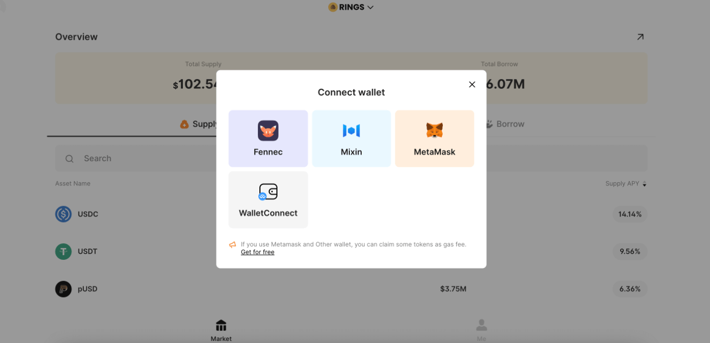

## PC Tutorials

When you enter the webpage, click on your avatar in the top left corner and connect Wallet will pop up, choose MetaMask Wallet. The URL is https://rings.pando.im/#/.

If you are logging in for the first time, please allow the creation and switch to the MVM network.

After successful connection, you can SUPPLY in the ME page at the bottom right. More detailed refer to [official documentation](https://docs.pando.im/docs/rings/tutorials/how-to-supply)

It is worth noting that if the coins are not displayed in the MVM, you need to add the coins yourself to see the corresponding coins in the MetaMask wallet.

## App Tutorials

If you have download Mixin Messenger, you can directly refer to the [official documentation](https://docs.pando.im/docs/rings/tutorials/rings-get-started). Here is how to use MetaMask to connect to Pando Rings without Mixin Messenger.

Open the URL below in the browser of the MetaMask wallet.

https://rings.pando.im/#/

Click on the avatar at the top left, select MetaMask, Approve, Switch Network, and you will logged in.

Transfer the assets from ETH chain to MVM and then you can interact with Pando Rings directly.

## How to add asset tokens

Take the LINK for example, you need to click the "+" on the right side of the balance and add the token to the MVM wallet so that we can see LINK TOKEN in wallet. The same operation is done on the PC side. 

