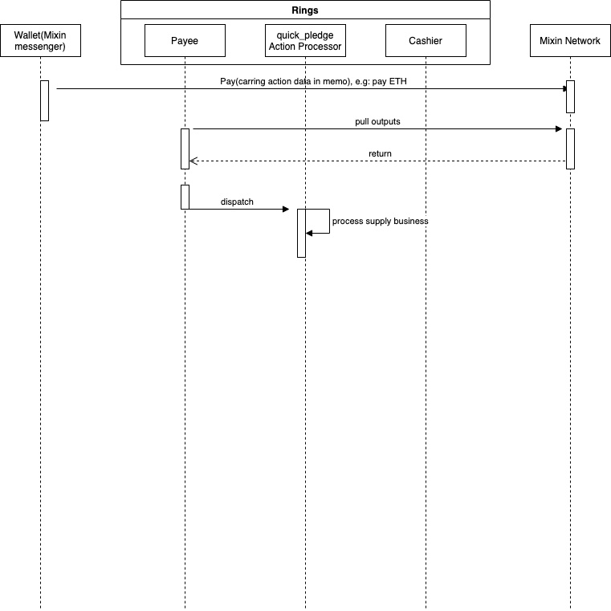

# Design

## Architecture

Rings는 MTG의 구현이며 Mixin 네트워크의 parachain입니다.


#### Mixin MTG 구조


#### MTG 시스템 데이터 흐름
* • 사용자는 비즈니스 데이터(UTXO) 를 포함하는 결제 정보를 Mixin 네트워크로 전송합니다.
* Rings는 비즈니스 데이터(output.memo에서)를 구문 분석하여 출력(UTXO)을 동기화합니다.
* Rings는 비즈니스 액션(비즈니스 데이터에 포함) 을 발송하고 각 액션(공급, 차입...) 을 처리합니다.


MTG 시스템에는 두 가지 주요 역할이 있습니다. 하나는 `Payee`이고 다른 하나는 `cashier`입니다. 모든 비즈니스 논리는 이 두 역할을 기반으로 구현됩니다.

* `Payee`는 출력(트랜잭션)을 수신하고, `Output.Memo`에서 비즈니스 데이터를 디코딩하고, `action`을 발송합니다. 

* `cashier`는 토큰을 소비하고 사용자에게 토큰을 전송합니다. 

#### Rings actions

* `Supply`, 예를 들어 사용자가 기본 토큰 `ETH`를 제공하고 지분 토큰 `rETH`를 얻는다는 것입니다. 

* `Pledge`, 예를 들어 사용자가 지분 토큰 `rETH`를 저당하려면 Rings system에게 `rETH`를 지불해야 합니다. 

* `Unpledge`, 예를 들어 사용자가 지분 토큰 `rETH`을 취소하려면 일부 토큰을 지불해야 하고 지분 토큰 `rETH`를 반환해야 합니다.. 

* `Redeem`, 예를 들어 사용자가 시스템에서 기본 토큰 `ETH`을 되찾으려면 지분 토큰 `rETH`를 지불하고 이에 상응하는 기본 토큰 `ETH`을 받을 수 있습니다. 

* `Borrow`, 예를 들어 사용자가 기본 토큰 `USDT`를 차용하려면 일부 토큰을 지불한 후 기본 토큰 `USDT`를 차입할 수 있습니다. 

* `Repay`, 예를 들어 사용자가 `USDT`를 상환하면 `USDT`를 지불하고 사용자의 부채가 줄어듭니다. 

* `quick_pledge`, 예를 들어 사용자가 기본 토큰 `ETH`를 제공하고 지분 토큰 `rETH`은 사용자에게 반환되지 않습니다. 
* `qick_redeem`, 예를 들어 사용자가 `ETH`를 되찾으려면 일부 토큰을 지불하고 `ETH`를 돌려받을 수 있습니다. 
* `quick_borrow`, 예를 들어 사용자가 `ETH` 또는 `rETH`를 제공하면 `USDT` 를 차입 할 수 있습니다. 


* `Liquidation`, 사용자 A가 `ETH`를 저당하고 `USDT`를 차용했다고 가정합니다. 사용자 A 계정의 유동성이 0보다 작거나 같으면 다른 사용자에 의해 청산될 수 있습니다. 

* `Proposal actions`, 모든 거버넌스 작업은 제안 투표를 통해 효과를 생성하며 현재 제안에는 다음이 포함됩니다.
    1. `market` 시장을 생성하거나 시장을 업데이트하는 데 사용
    2. `open-market` 시장을 오픈하는데 사용
    3. `close-market` 시장을 폐쇄하는데 사용
    4. `allowlist` 청산 허용 여부
    5. `add-oracle-signer` 시장 가격을 제공하는 가격 오라클 서명자를 추가
    6. `rm-oracle-signer` 가격 오라클 서명자 제거
    7. `withdraw` 시장에서 준비금을 인출 

## Code struct

```

---
|-cmd      
|-config  
|-deploy  
|-docs    
|-core 
|-pkg     
|-service 
|-store   
|-worker  
|-handler    
|-Dockerfile 
|-Makefile
|-main.go 

```

* [cmd](https://github.com/fox-one/compound/tree/master/cmd)명령 입구, api server의 시작, 작업자 및 거버넌스 도구를 포함
* [config](https://github.com/fox-one/compound/tree/master/config) 기본 구성 디렉토리
* [docs](https://github.com/fox-one/compound/tree/master/docs) 프로젝트 문서
* [core](https://github.com/fox-one/compound/tree/master/core) 프로젝트 모델 디렉토리
* [pkg](https://github.com/fox-one/compound/tree/master/pkg) 내보낼 수 있는 프로젝트 패키지
* [service](https://github.com/fox-one/compound/tree/master/service) 비즈니스 코드 디렉토리
* [store](https://github.com/fox-one/compound/tree/master/store) 데이터 저장소(데이터는 데이터베이스 또는 redis 또는 메모리 캐시에 저장될 수 있음)
* [worker](https://github.com/fox-one/compound/tree/master/worker) 백그라운드에서 데이터를 처리하는 작업의 디렉토리
* [handler](https://github.com/fox-one/compound/tree/master/handler) 내보낸 api에만 해당
* [Dockerfile](https://github.com/fox-one/compound/tree/master/Dockerfile) 배치에 사용
* [deploy](https://github.com/fox-one/compound/tree/master/deploy) 구성 및 배치 도구 저장
* [main.go](https://github.com/fox-one/compound/tree/master/main.go)
* [Makefile](https://github.com/fox-one/compound/tree/master/Makefile)

### [템플릿 구성](https://github.com/fox-one/compound/tree/master/deploy/config.node.yaml.tpl)

```
# Fixed value : 1603382400 
genesis: 1603382400
# time localtion
location: Asia/Shanghai

# data base config
db:
  dialect: mysql
  host: ~
  read_host: ~
  port: 3306
  user: ~
  password: ~
  database: ~
  location: Asia%2FShanghai
  Debug: true

# mixin dapp config
dapp:
  num: 7000103159
  client_id: ~
  session_id: ~
  client_secret: ~
  pin_token: ~
  pin: ""
  private_key: ~

# nodes group config
group:
# private key shared by all nodes, that generated by the command: ./compound keys --cipher ed25519
  private_key: ~
  # The private key used by the current node for user data signing
  sign_key: ~
  # administratories of this node
  admins:
    - ~
    - ~
    - ~ 
  # Node member
  members:
    - client_id: ~
    # The public key used by the current node to verify the signature
      verify_key: ~
  threshold: 2
  vote:
    asset: 965e5c6e-434c-3fa9-b780-c50f43cd955c
    amount: 0.00000001
```

#### 애플리케이션 레이어용으로 내보내기 위한 [Rest APIs](https://github.com/fox-one/compound/tree/master/handler/rest/rest.go), 다음을 포함합니다.

```
/markets/all   //모든 시장에 응답
/transactions  //복합 트랜잭션에 응답
/price-requests // 가격 오라클 호출
```

#### Worker
* [cashier](https://github.com/fox-one/compound/tree/master/worker/cashier/cashier.go) 보류 중인 송금을 처리합니다. mixin 네트워크로의 트랜잭션 전송을 준비합니다.
* [syncer](https://github.com/fox-one/compound/tree/master/worker/syncer/syncer.go) Mixin 네트워크의 출력(UTXO)을 동기화합니다.
* [txsender](https://github.com/fox-one/compound/tree/master/worker/txsender/sender.go) raw transaction을 Mixin 네트워크로 전송합니다.
* [spentsync](https://github.com/fox-one/compound/tree/master/worker/spentsync/spentsync.go) 전송 상태를 동기화하고 업데이트합니다.
* [priceoracle](https://github.com/fox-one/compound/tree/master/worker/priceoracle/priceoracle.go) 가격을 가져와 체인에 가격을 넣습니다.
* [payee](https://github.com/fox-one/compound/tree/master/worker/snapshot/payee.go) 출력을 처리하고 비즈니스 작업을 발송합니다.

#### Action processing
* [borrow](https://github.com/fox-one/compound/tree/master/worker/snapshot/borrow.go) borrow action event를 처리합니다.
* [supply](https://github.com/fox-one/compound/tree/master/worker/snapshot/supply.go) supply action event를 처리합니다.
* [pledge](https://github.com/fox-one/compound/tree/master/worker/snapshot/supply_pledge.go) pledge action event를 처리합니다.
* [unpledge](https://github.com/fox-one/compound/tree/master/worker/snapshot/supply_unpledge.go) unpledge action event를 처리합니다.
* [redeem](https://github.com/fox-one/compound/tree/master/worker/snapshot/supply_redeem.go) redeem action event를 처리합니다.
* [repay](https://github.com/fox-one/compound/tree/master/worker/snapshot/borrow_repay.go) repay action event를 처리합니다.
* [liquidation](https://github.com/fox-one/compound/tree/master/worker/snapshot/liquidation.go) liquidation action event를 처리합니다.
* [proposal](https://github.com/fox-one/compound/tree/master/worker/snapshot/proposal.go) 제안 조치 처리 및 발송: 시장 추가, 시장 업데이트, 시장 폐쇄 또는 개방, 허용 목록 추가 또는 제거, 인출을 포함합니다.
* [price](https://github.com/fox-one/compound/tree/master/worker/snapshot/price.go) price protocal action event를 처리합니다.


### 시장 무역 억제 메커니즘

> 특정 시장의 가격이 비정상적일 때 시장을 닫습니다.

* 시장 가격이 악의적으로 공격을 받으면 관리자는 `close-market` 주문을 실행하고 시장 폐쇄 투표를 신청할 권리가 있습니다. 요청이 승인되면 시장이 닫힙니다.
* 폐쇄된 시장에서는 거래가 금지됩니다.
* 그러나 폐쇄된 시장이 있는 한 모든 시장의 청산은 금지됩니다. 청산은 사용자의 모든 시장 계정의 유동성에 영향을 미치기 때문입니다.

## 복합 프로토콜의 구현

* [Interest rate model](https://github.com/fox-one/compound/tree/master/internal/compound/interest_rate_model.go)은 복합 프로토콜의 핵심 구현입니다.

* [Borrow balance](https://github.com/fox-one/compound/tree/master/core/borrow.go) 사용자 차입 잔액에는 차입 원금과 차입 이자가 포함됩니다. `balance = borrow.principal * market.borrow_index / borrow.interest_index`

* [Accrue interest](https://github.com/fox-one/compound/tree/master/service/market/market.go) 이자 발생은 공급, 차입, 담보, 담보 해제, 상환, 가격 업데이트와 같은 시장 거래 데이터에 변화를 일으키는 행위가 있을 때만 발생합니다. 그리고 같은 블록에서 한 번만 계산됩니다.

```
    blockNumberPrior := market.BlockNumber

    blockNum, e := s.blockSrv.GetBlock(ctx, time)
    if e != nil {
        return e
    }

    blockDelta := blockNum - blockNumberPrior
    if blockDelta > 0 {
        borrowRate, e := s.curBorrowRatePerBlockInternal(ctx, market)
        if e != nil {
            return e
        }

        if market.BorrowIndex.LessThanOrEqual(decimal.Zero) {
            market.BorrowIndex = borrowRate
        }

        timesBorrowRate := borrowRate.Mul(decimal.NewFromInt(blockDelta))
        interestAccumulated := market.TotalBorrows.Mul(timesBorrowRate)
        totalBorrowsNew := interestAccumulated.Add(market.TotalBorrows)
        totalReservesNew := interestAccumulated.Mul(market.ReserveFactor).Add(market.Reserves)
        borrowIndexNew := market.BorrowIndex.Add(timesBorrowRate.Mul(market.BorrowIndex))

        market.BlockNumber = blockNum
        market.TotalBorrows = totalBorrowsNew.Truncate(16)
        market.Reserves = totalReservesNew.Truncate(16)
        market.BorrowIndex = borrowIndexNew.Truncate(16)
    }

```