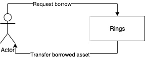

[Mixin](https://github.com/MixinNetwork/mixin) [MTG](https://github.com/MixinNetwork/developers.mixin.one/blob/main/developers/src/i18n/en/document/mainnet/mtg.md) 기술에 기반한 [compound 프로토콜](https://github.com/compound-finance/compound-protocol)입니다.

## rToken

일정량의 암호화폐를 시장에 제공한 후 획득하는 해당 토큰.

## 기능

### Supply

사용자는 암호화폐를 시장에 공급하여 유동성을 제공하고, 해당하는 rToken을 얻습니다. 유동성을 제공함으로써 이자 수익을 받습니다.

### Pledge

사용자는 차입하기 전에 rToken을 시장에 저당해야 합니다.

### Unpledge

사용자는 시장에 저당한 rToken을 회수합니다.

### Redeem

사용자는 rToken의 반환을 통해 유동성을 제공한 암호화폐와 유동성 제공에 대한 보상으로 얻은 이자 수익을 돌려 받습니다.

### Borrow

사용자는 시장에서 일정한 금리로 암호화폐를 빌립니다.

### Repay

사용자는 차입한 암호화폐와 차입 기간 동안 발생한 이자를 상환합니다.

### Liquidation

시장 가격의 변동으로 인해 사용자의 대출 가치는 담보 자산의 가치를 초과할 수 있습니다. 그러한 경우, 다른 사용자는 사용자의 저당자산이 커버하지 못한 채무를 상환하기 위해 더 낮은 가격으로 사용자의 저당잡힌 자산을 취득할 수 있습니다.

