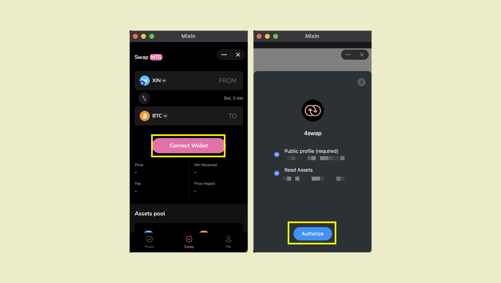

import { Improvement, } from "@site/src/components/admonitions";

<Improvement />

**[Pando Lake](https://lake.pando.im)**는 널리 검증되고 엄선된 유동성 풀만 허용합니다. 대중으로부터 새로운 풀을 받아들이지 않습니다.

**[4swap](https://4swap.org)**은 현재 모든 풀을 추가할 수 있는 커뮤니티 주도 프로젝트입니다.

## Mixin 네트워크에 자산 정보 추가

Mixin의 [asset-profile](https://github.com/MixinNetwork/asset-profile) 페이지를 방문하여 `README.md`의 지침에 따라 Mixin Network를 방문하세요.

예를 들어 "RUM"이라는 ERC-20 토큰이 있는 경우 Mixin Network에 추가할 수 있습니다.

1. "icon.png"라는 아이콘 파일은 520px * 520px이어야 합니다.
2. "index.json"이라는 json 파일, 유효한 json 파일이어야 하며 다음 정보를 포함합니다.

```json
{
  // Mixin 네트워크에서 RUM의 자산 ID
  "asset_id": "4f2ec12c-22f4-3a9e-b757-c84b6415ea8f",
  // RUM은 ERC-20 토큰이고 체인 ID는 ETH의 자산 ID입니다.
  "chain_id": "43d61dcd-e413-450d-80b8-101d5e903357",
  // RUM은 CoinMarketCap에 등록되어 있지 않으므로 빈 문자열을 사용합니다.
  "cmc_id": ""
}
```

위 예시의 커밋은 [여기](https://github.com/MixinNetwork/asset-profile/commit/437d378f899c5837598bdb8c4e9c18ae8f21ad27)입니다.

````mdx-code-block
:::info
완료되면 풀 리퀘스트를 생성하십시오. Mixin Network에서 pull request를 처리하는 데는 보통 1~2일 정도 소요됩니다.
:::
````

## 4swap에서 풀 생성

유동성 풀을 생성하려면[Mixin Messenger](../../apps/wallets#mixin-messenger) 또는[Fennec](../../apps/wallets#fennec) 로 이동해야 합니다.

1. 두 자산의 지갑 잔액이 최소 금액인 0.00000001 이상인지 확인하십시오. 그렇지 않은 경우 지갑에 일부를 입금하십시오.
2. 지갑에 최소 0.02 ETH 이상이 있는지 확인하십시오. 그렇지 않은 경우 지갑에 입금하거나 [4swap](https://app.4swap.org)에서 교환하세요.
3. [이 페이지](https://app.4swap.org/#/me)를 방문하여 "연결"을 탭하여 지갑과 연결하세요.



4. [이 페이지](https://app.4swap.org/#/liquidity/create)를 방문하여 풀에 추가할 두 개의 자산을 선택하고 `지불`을 탭하여 풀을 생성합니다.

코인마켓캡 랭킹, 거래량, 거래소 지원 등을 고려하여 화폐 상장 여부를 종합적으로 검토할 예정입니다.

또한 mixin messenger로 37160854에 연락하여 leaf/rings 목록을 문의하실 수 있습니다.

````mdx-code-block
:::info
풀이 생성되고 [MTG 노드](../key-concepts/mtg)에서 승인되기까지 보통 1~3일이 걸립니다. 요청이 3일 이내에 처리되지 않으면 환불을 받게 됩니다.
:::
````