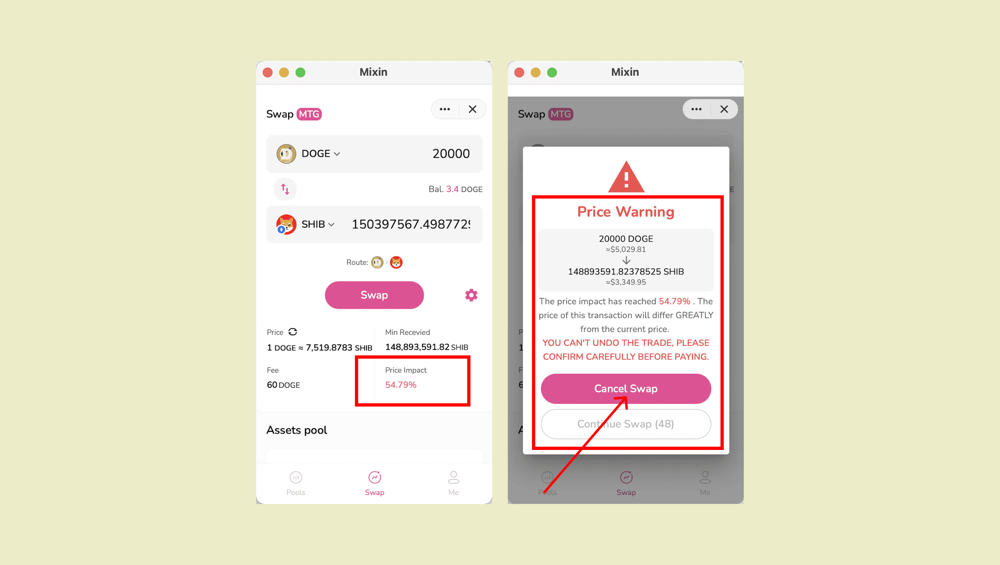

기어 아이콘을 탭하여 [슬리피지(slippage)](https://docs.pando.im/docs/lake/key-concepts/slippage-impernament-loss)를 설정할 수 있습니다.


이 경로는 거래가 처리될 단계를 보여줍니다.


알고리즘은 가능한 많은 자산을 받을 수 있도록 최적의 경로를 계산합니다.


 6자리 PIN을 입력하여 결제를 완료하면 거래 내역이 팝업됩니다. 대화 창에서도 거래 내역을 확인할 수 있습니다.




[거래 수수료](https://docs.pando.im/docs/lake/key-concepts/trading-fee)를 보시려면 클릭하세요.

````mdx-code-block
:::caution

swapping 시 가격 영향에 유의하시기 바랍니다. 

가격 영향이 너무 크다는 것은 거래의 유동성이 부족하거나 거래 금액이 너무 크다는 것을 의미하며, 거래를 지속하면 손실이 더 커질 수 있습니다.

:::
````