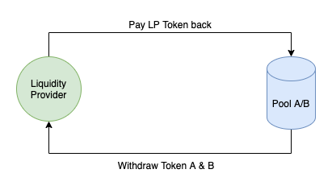

Pando Lake 是一个 在 Mixin Network 上使用 MTG 技术构建的 [Uniswap](https://uniswap.org) v2 实现。 得益于Mixin超乎寻常的TPS，Pando Lake在交易上表现出色，大多数交易几秒钟内就能完成确认。

## Pando Lake 简介

### 治理

Pando lake 由五个可信节点维护。 创建新池之类的提议必须至少得到三个节点的批准。

### 流动池

每个流动池持有两个代币，它们共同代表这些资产的交易对。 流动性提供者将代币存入池中，让交易者进行交易；作为回报，交易费用根据流动性贡献比例全部给予流动性提供者。

### LP 代币

每个矿池都有一个唯一的代币（LP Token）来代表流通的流动性。 持有LP Token是提供流动性的证明，提取流动性也需要支付LP Token。

LP Token 的总市值等于矿池中两个代币的市值之和。

## 操作

### 存入

增加流动池的储备成为流动性提供者。

### 取回

将 LP Token 支付回流动池以提取其中的 Token。 流动池的储备将减少。

### 交易

流动池总是自动处理交易者的请求。 用户可以通过任意一方的流动池进行交易，Pando Lake 最多支持 4 个流动池进行一笔交易。

## 总结

Pando Lake 实现了去中心化可信节点共识的目标，为 Mixin Network 的所有用户带来了具有多种 AMM 公式的 dex 服务。

Pando Lake 表现不错，但还远远不够。 我们正在开发一些新的流动池，以使流动性更加灵活和高效。 可信节点的管理也需要更加开放，以吸引更多的参与者。

