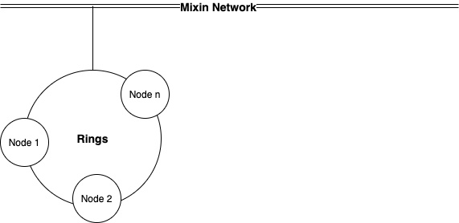
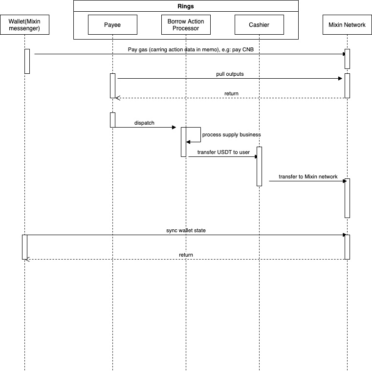

# 设计

## 架构

Rings 是 MTG 的一个实现，也是 Mixin Network的平行链。



#### Mixin MTG 结构


#### MTG系统数据流
* 用户将携带业务数据（UTXO）的支付信息转到 Mixin Network。
* Rings 通过解析业务数据（在 output.memo 中）同步输出（UTXO）
* Rings 调度业务操作（包含在业务数据中）并处理每个操作（供应、借出...）


在MTG系统中，主要有两个角色，一个是`Payee`，另一个是 `Cashier`，所有的业务逻辑都是基于这两个角色来实现的。

* `Payee` 接收输出（交易），从`Output.Memo` 解码业务数据，调度`actions` 

* `cashier` 消费代币，将代币转给用户 

#### Rings Actions

* `供应`：例如用户提供了 `ETH`，获得权益代币 `rETH` 这一过程。 

* `质押`：例如用户质押权益代币 `rETH`，即用户向Rings系统支付 `rETH` 这一过程。 

* `取消抵押`，假设用户取消抵押股权代币`rETH`，意味着用户需要支付一定量的代币同时将相应的权益代币`rETH` 归还。 

* `赎回`，假设用户从系统中赎回底层代币`ETH`，即用户支付权益代币`rETH`，即可获得等价的底层代币`ETH` 返回 

* `借款`，假设用户需要借入底层代币`USDT`，意味着用户支付一些代币后即可获得想要借入的底层代币`USDT` 

* `还款`，假设用户偿还`USDT`，即用户支付`USDT`，用户的债务就会减少 

* `快速质押`，假设用户提供底层代币`ETH`，没有权益代币`rETH`返还给用户 
* `快速赎回`，假设用户需要赎回`ETH`，用户只需要支付一些代币，即可以将底层代币`ETH`赎回 
* `快速借出`，假设用户可以供应`ETH`或`rETH`，可以借用`USDT` 


* `清算`，例如用户A质押了`ETH`并借入了`USDT`，一旦用户A账户的流动性小于等于0，就可以被其他用户清算 。 

* `提案`，所有治理工作通过提案投票产生效果，目前的提案包括：
    1. `market` 用于创建市场或更新市场
    2. `open-market` 用于开放市场
    3. `close-market` 用于关闭市场
    4. `allowlist` 是否允许清算
    5. `add-oracle-signer` 添加提供市场价格的oracle签名者
    6. `rm-oracle-signer` 移除 oracle 签名者
    7. `withdraw` 从市场上撤回准备金 

## 代码结构

```

---
|-cmd      
|-config  
|-deploy  
|-docs    
|-core 
|-pkg     
|-service 
|-store   
|-worker  
|-handler    
|-Dockerfile 
|-Makefile
|-main.go 

```

* [cmd](https://github.com/fox-one/compound/tree/master/cmd) 命令入口，包括启动 api server 和 worker 以及治理工具
* [config](https://github.com/fox-one/compound/tree/master/config) 默认配置目录
* [docs](https://github.com/fox-one/compound/tree/master/docs) 项目文档
* [core](https://github.com/fox-one/compound/tree/master/core) 项目模型目录
* [pkg](https://github.com/fox-one/compound/tree/master/pkg) 可以导出的项目包
* [service](https://github.com/fox-one/compound/tree/master/service) 业务代码目录
* [store](https://github.com/fox-one/compound/tree/master/store)数据存储库（数据可能存储在数据库或redis或内存缓存中）
* [worker](https://github.com/fox-one/compound/tree/master/worker) 目录，用于在后台处理数据的作业
* [handler](https://github.com/fox-one/compound/tree/master/handler) 仅用于导出的 api
* [Dockerfile](https://github.com/fox-one/compound/tree/master/Dockerfile) 用于部署
* [deploy](https://github.com/fox-one/compound/tree/master/deploy) 存储配置和部署工具
* [main.go](https://github.com/fox-one/compound/tree/master/main.go)
* [Makefile](https://github.com/fox-one/compound/tree/master/Makefile)

### [配置模板](https://github.com/fox-one/compound/tree/master/deploy/config.node.yaml.tpl)

```
# Fixed value : 1603382400 
genesis: 1603382400
# time localtion
location: Asia/Shanghai

# data base config
db:
  dialect: mysql
  host: ~
  read_host: ~
  port: 3306
  user: ~
  password: ~
  database: ~
  location: Asia%2FShanghai
  Debug: true

# mixin dapp config
dapp:
  num: 7000103159
  client_id: ~
  session_id: ~
  client_secret: ~
  pin_token: ~
  pin: ""
  private_key: ~

# nodes group config
group:
# private key shared by all nodes, that generated by the command: ./compound keys --cipher ed25519
  private_key: ~
  # The private key used by the current node for user data signing
  sign_key: ~
  # administratories of this node
  admins:
    - ~
    - ~
    - ~ 
  # Node member
  members:
    - client_id: ~
    # The public key used by the current node to verify the signature
      verify_key: ~
  threshold: 2
  vote:
    asset: 965e5c6e-434c-3fa9-b780-c50f43cd955c
    amount: 0.00000001
 
Text
XPath: /pre[2]/code
```

#### 为应用层导出的[Rest API](https://github.com/fox-one/compound/tree/master/handler/rest/rest.go)，包括：

```
/markets/all //响应所有市场
/transactions //响应复合事务
/price-requests // 用于价格预言机调用
```

#### Worker
* [cashier](https://github.com/fox-one/compound/tree/master/worker/cashier/cashier.go) 处理待处理的转账。 准备将交易转移到 Mixin 网络。
* [syncer](https://github.com/fox-one/compound/tree/master/worker/syncer/syncer.go) 同步 Mixin 网络的输出（UTXO）。
* [txsender](https://github.com/fox-one/compound/tree/master/worker/txsender/sender.go) 将原始交易转移到 Mixin 网络。
* [spentsync](https://github.com/fox-one/compound/tree/master/worker/spentsync/spentsync.go) 同步并更新传输状态。
* [priceoracle](https://github.com/fox-one/compound/tree/master/worker/priceoracle/priceoracle.go) 获取价格并将价格放到链上。
* [payee](https://github.com/fox-one/compound/tree/master/worker/snapshot/payee.go) 处理输出并调度业务操作。

#### 操作处理
* [borrow](https://github.com/fox-one/compound/tree/master/worker/snapshot/borrow.go) 处理借出事件。
* [supply](https://github.com/fox-one/compound/tree/master/worker/snapshot/supply.go) 处理供应事件。
* [pledge](https://github.com/fox-one/compound/tree/master/worker/snapshot/supply_pledge.go) 处理质押事件。
* [unpledge](https://github.com/fox-one/compound/tree/master/worker/snapshot/supply_unpledge.go) 处理取消抵押事件。
* [redeem](https://github.com/fox-one/compound/tree/master/worker/snapshot/supply_redeem.go) 处理赎回事件。
* [repay](https://github.com/fox-one/compound/tree/master/worker/snapshot/borrow_repay.go) 处理还款事件。
* [liquidation](https://github.com/fox-one/compound/tree/master/worker/snapshot/liquidation.go)处理清算行动事件。
* [proposal](https://github.com/fox-one/compound/tree/master/worker/snapshot/proposal.go) 处理和调度提案动作，包括：添加市场、更新市场，关闭或打开市场，添加或删除许可名单，取回。
* [price](https://github.com/fox-one/compound/tree/master/worker/snapshot/price.go) 处理价格协议事件。


### 市场保护机制

> 当某个市场的价格出现异常时关闭市场。

* 当市场价格受到恶意攻击时，管理者有权执行`close-market`指令并申请关闭市场投票。 如果投票获得批准，市场将被关闭。
* 禁止在已关闭的市场进行交易。
* 但是，只要有封闭的市场，所有市场的平仓都会被禁止，因为平仓会影响用户所有市场账户的流动性。

## compound协议的实现

* [利率模型](https://github.com/fox-one/compound/tree/master/internal/compound/interest_rate_model.go)是compound协议的核心实现。

* [欠款余额](https://github.com/fox-one/compound/tree/master/core/borrow.go) 用户欠款余额包含借出本金和借款利息。 `balance = borrow.principal * market.borrow_index / borrow.interest_index`

* [应计利息](https://github.com/fox-one/compound/tree/master/service/market/market.go) 应计利息仅在市场交易数据中存在导致变化的行为时发生，例如供应、借入、质押、取消质押、赎回、偿还、价格更新。 并且只在同一个区块中计算一次。

```
    blockNumberPrior := market.BlockNumber

    blockNum, e := s.blockSrv.GetBlock(ctx, time)
    if e != nil {
        return e
    }

    blockDelta := blockNum - blockNumberPrior
    if blockDelta > 0 {
        borrowRate, e := s.curBorrowRatePerBlockInternal(ctx, market)
        if e != nil {
            return e
        }

        if market.BorrowIndex.LessThanOrEqual(decimal.Zero) {
            market.BorrowIndex = borrowRate
        }

        timesBorrowRate := borrowRate.Mul(decimal.NewFromInt(blockDelta))
        interestAccumulated := market.TotalBorrows.Mul(timesBorrowRate)
        totalBorrowsNew := interestAccumulated.Add(market.TotalBorrows)
        totalReservesNew := interestAccumulated.Mul(market.ReserveFactor).Add(market.Reserves)
        borrowIndexNew := market.BorrowIndex.Add(timesBorrowRate.Mul(market.BorrowIndex))

        market.BlockNumber = blockNum
        market.TotalBorrows = totalBorrowsNew.Truncate(16)
        market.Reserves = totalReservesNew.Truncate(16)
        market.BorrowIndex = borrowIndexNew.Truncate(16)
    }

```