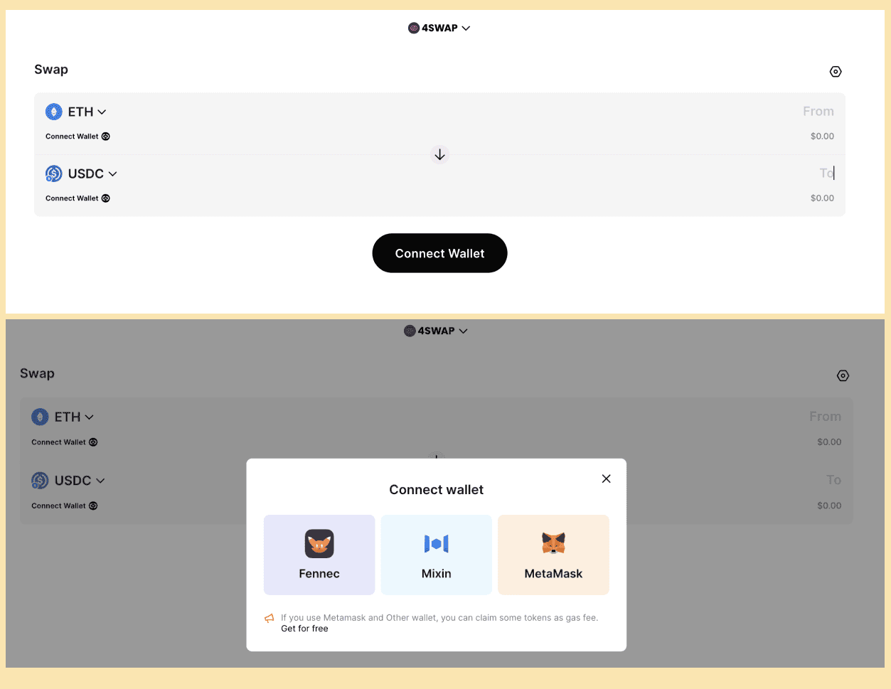

在学习如何使用MetaMask连接4swap之前，你需要安装MetaMask钱包并熟悉其基本功能。 如果你还不熟悉，你可以访问[MetaMask支持](https://metamask.zendesk.com/hc/en-us)以获得指导。

为确保你的资产安全，请严格遵守安全指示。 请确保将您的私人密钥和密码保存在安全和私密的地方。

现在，我们已经准备好讨论如何用MetaMask连接4swap。

## 第一步：添加MVM网络到你的MetaMask钱包中

### 选项 1

1. 转到MetaMask，保持你的会话处于活动状态。

      

2. 转到[MVM区块链浏览器](https://scan.mvm.dev/)。 你可以在页面底部看到 "Add MVM to MetaMask"。

     

3. 点击该项目，你会看到一个确认窗口弹出。点击 "允许"按钮。

     

### 选项 2

1. 打开你的MetaMask插件（ 在屏幕的右上方），点击显示你当前选定网络的按钮。 在网络下拉菜单中，你会看到底部的 "添加网络"。 点击它。

   

2. 你将被引导到一个新窗口，要求你填写新网络的信息。 复制以下信息，并将它们填入页面上的相应方框。 然后点击"保存"。

   

   网络名称：Mixin Virtual Machine

   网络网址：https://geth.mvm.dev

   链条ID： 73927

   货币符号: ETH

   区块浏览器： https://scan.mvm.dev/

之后，你成功地将 "Mixin虚拟机 "添加到你的MetaMask中，它被选为你的当前网络。 你可以点击下拉菜单，切换到其他网络。

- 

## 第二步：通过跨链桥，利用其他网络将资产发送至MVM网络

接下来，你需要将一些资产转移到MVM地址。 这是用Mixin Network提供的官方跨链桥完成的。

1. 启动[资产桥](https://mvg.finance/)并链接MetaMask钱包。

   

2. 选择你要用于MVM网络充值的网络。 这里选择 "Ethereum Mainnet "作为例子。

   

3. 点击 "存款"，然后确认从当前钱包存款。 你会在弹出的窗口中看到一个地址。 你可以直接向这个地址汇款，作为给你的MVM钱包充值的另一种方式。

   

   

4. 确认存款后，等待一段时间，你会看到MetaMask钱包里的余额发生变化。 建议你第一次只存一小笔钱作为测试。

   

## 第三步：将您的MetaMask钱包连接到4swap并开始交易

将资产存入MVM地址后，现在你已完成通过4swap进行交易的准备。

1. 将您的MetaMask钱包连接到[4swap](https://4swap.org/)。

   

   

2. 选择代币并输入数量后，点击 "交换"。

   

3. 给它一些时间来处理交易。

   

恭喜！ 按照上述步骤，你将能够在4swap中使用MetaMask钱包成功进行资产交换。 享受闪电般的快速、免gas费的交易体验!

## 加入Pando社区

欢迎加入我们的社区，关注最新的社区趋势或活动信息。

- Twitter: [@4swapOrg](https://twitter.com/4swapOrg)

- Telegram: [t.me/its_4swapOrg](https://t.co/g7Vioijgjb)

- Discord: https://discord.com/invite/ek45g3Cymd

- Reddit: https://www.reddit.com/r/pando/

如果您已经下载了[Mixin Messenger](https://mixin.one/messenger)，随时欢迎加入我们的Mixin社区。

4swap社区: 7000103925

Pando 社区: 7000104110

如果您在使用Pando时遇到问题，您可以查看[Pando文档](https://docs.pando.im/)或在社区中提问。 管理员将很乐意帮助你。