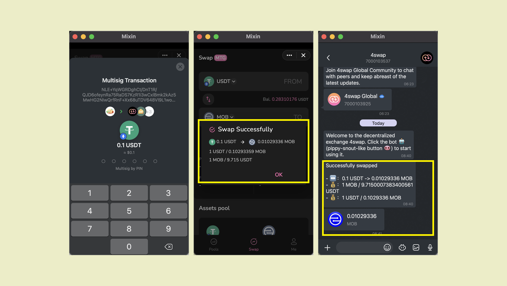

通过点击齿轮图标，您可以设置[价格滑点](https://docs.pando.im/docs/lake/key-concepts/slippage-impernament-loss)


兑换路径显示您的交易将被处理的步骤。


算法计算最佳路线，以便您可以获得尽可能多的资产。


 输入6位PIN码完成支付后，会弹出交易详情。 您还可以在对话窗口中查看交易详情。


点击查看 [交易费用](https://docs.pando.im/docs/lake/key-concepts/trading-fee).

````mdx-code-block
:::caution

交易时请注意价格影响。 

当价格影响太大时，表示交易缺乏流动性或交易金额过大，继续交易可能造成较大的损失。

:::
````