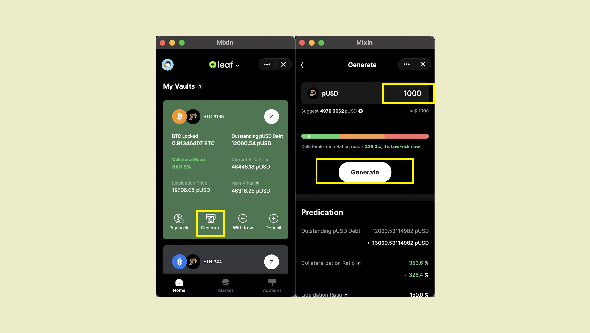

要铸造pUSD，请单击“铸造”，并在铸造页面上填写铸造的金额。



数据更改为最新版本，您可以在聊天窗口中查看有关此次铸造的详细信息。


同时，您需要小心相关风险。

````mdx-code-block
:::caution

请确保抵押利率在一个安全范围内，抵押率低于150% 的抵押资产将完全被平仓清算。

:::
````

````mdx-code-block
:::info

您可能需要[Pando Seed](https://docs.pando.im/docs/leaf/key-concepts/pando-seed)来协助此操作。

:::
````
