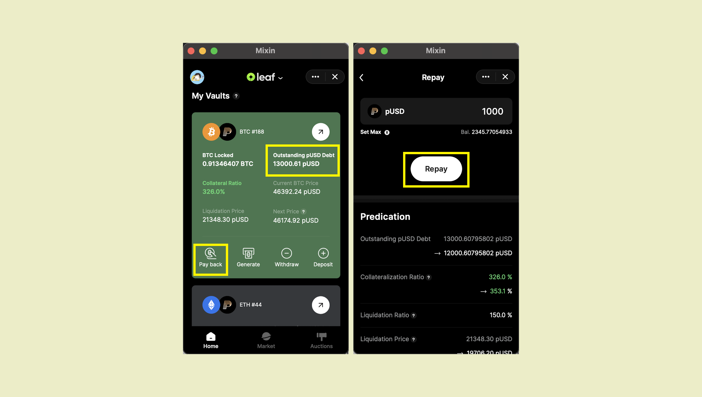

如果想避免抵押的资产被清算，或者资产所有者想降低抵押比例释放抵押物时，可以通过偿还pUSD实现。

如果要进行偿还，请“还款”页面，点击“还款”按钮 您可以手动填写您打算偿还的金额，或单击“全额还款”以偿还所有债务。

当您偿还pUSD后，债务从13000pUSD减少到12000pUSD，您也可以在聊天窗口中查看还款的详细信息。

请注意，当您点击“全额还款”时，您将被收取略高于未偿债务金额的费用，以便能成功偿还债务，因为债务利息是实时计算和累计的。 付款后，超出的还款金额都将退回到您的钱包中。

