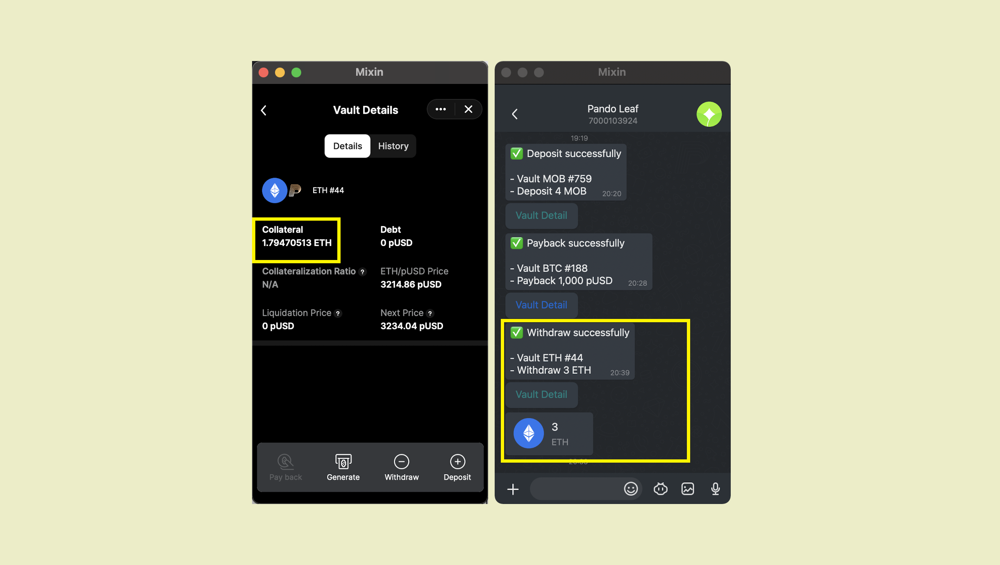

要从金库（抵押池）中提取抵押品并将其退回钱包，请单击“提取”以继续。


输入您想要提取的金额 ，单击提取，然后 输入PIN，ETH抵押品从4.7947减少到1.7947。 您也可以在聊天窗口中查看有关此次提取的详细信息。




````mdx-code-block
:::caution
请注意，在不先偿还铸造的pUSD的情况下提取抵押品将导致抵押率下降，并使金库面临更高的清算风险。
:::
````

````mdx-code-block
:::info
您可能需要 [Pando Seed](https://docs.pando.im/docs/leaf/key-concepts/pando-seed) 去执行这项操作。
:::
````


