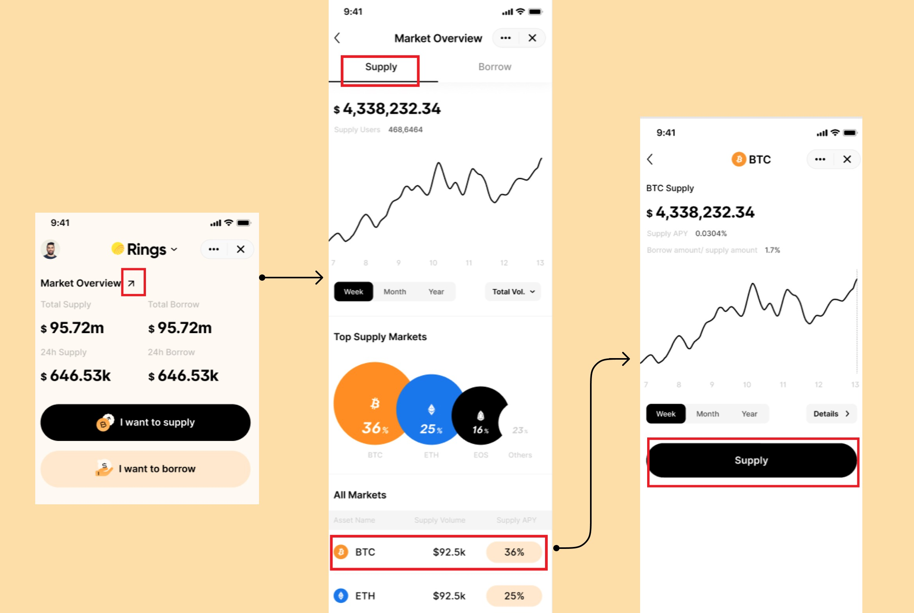

供应是使用Pando Rings的第一步。 当用户向Pando Rings供应资产时，他们便可以立即开始赚取利息。 每分钟都会产生利息； 用户可以随时提取本金加利息。

要供应资产，您可以点击市场页面上的“我想供应”。 它将带您进入您可以选择的供应资产列表。 您将看到资产的[供应量](../key-concepts/glossary)和[供应APY](../key-concepts/glossary)。

单击资产后，您将进入供应页面。

如果您已经进入市场概览页面，并选择查看特定市场的统计数据，您也可以找到供应条目。 您将在资产统计页面上找到供应条目。

如果您尚未提供任何资产，您还可以在“我”页面上找到要提供的条目。 单击“转到供应”，您将进入供应页面。

在供应页面上，您将看到与供应流程相关的关键指标，包括资产的供应 APY、您为特定资产提供的数量（“**供应**”）、 您提供的所有资产的总金额（**总供应量**），您尚未抵押作为抵押品的总金额（**总金额 未抵押**）以及 rToken 与其标的资产之间的汇率。

输入您要供应的资产数量，您将看到一个底部的表格，询问您是否要质押供应量。 右侧箭头上的百分比代表[抵押物因素](../key-concepts/glossary)。

由于在Pando Rings上借款前需要质押，如果选择“**供应并质押**”，您将立即获得借款能力； 或者如果您只想通过提供资产赚取一些利息，您可以选择“仅提供”。

